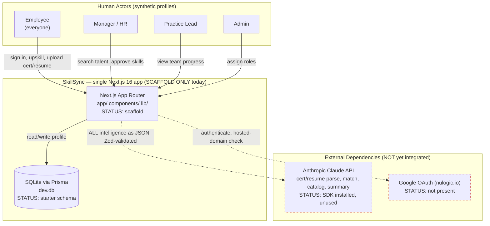
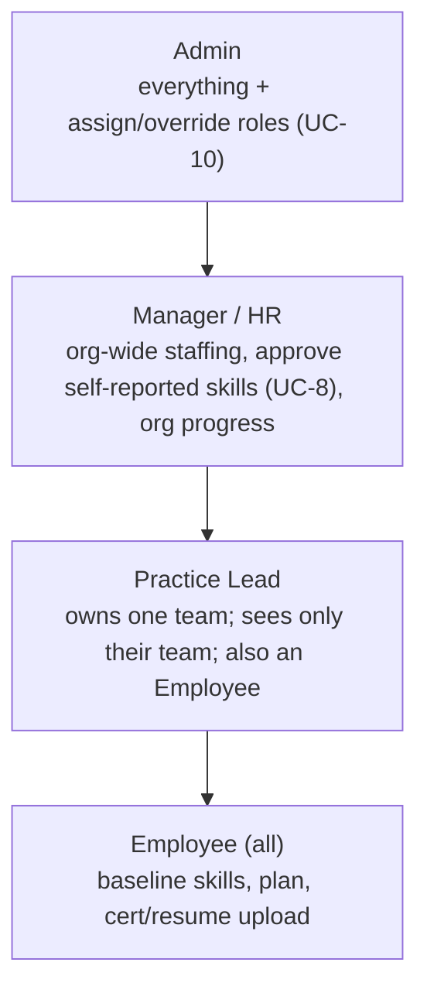

# Current State — Page 01: System Overview

**Initiative:** `skillsync-vertex-hackathon` (Team Vertex · NULogic AI Hackathon 2026)
**Stage:** 03-architecture · sub-phase: current-state · **Version:** v1
**Mode:** CURRENT-STATE (evidence-based) · **Repository classification:** GREENFIELD
**Branding:** NULogic. **Data constraint:** Synthetic only — never real names, emails, or PII.

> **Evidence note.** LightRAG and Dynatrace MCP servers were **unavailable** for this run (local-only learning environment, no remote org indexing). Per the agent fallback path, evidence was collected by **direct inspection** of the single local repo `ai-nu-skillsync` (`evidence_collection_method: "direct_scan"`). All claims below are grounded in actual files in that repo with `file:line` references. Where the PRD requires capability that does not yet exist in code, it is stated honestly as a gap, not invented.

> **Honesty header — this is greenfield.** The SkillSync **product is not built**. What exists is a fresh **Next.js 16 scaffold** with the *planned* dependency stack pre-installed and a **STARTER** Prisma schema. There are **no services**, **no API routes**, **no auth**, **no Claude integration code**, **no tests**, and **no feature code** yet. Page 04 (gap analysis) is therefore the load-bearing page: effectively the entire PRD is net-new work.

---

## 1. Purpose & Business Context

SkillSync is a hackathon MVP for **NULogic**, a ~150-person services company. It targets two manual, disconnected internal processes (PRD §1):

1. **Staffing** — managers/HR pick people for client engagements from memory and stale resumes. There is no fast way to ask *"who has skill X **and** is free within two weeks?"*
2. **Upskilling** — every employee must complete 2–3 certs/courses per year, tracked in spreadsheets with **no proof** and no link to a live skill record.

**Product bet (PRD §1, SPEC §1).** One **living Employee Skill Profile** feeds two role-aware modules — an **Upskilling Tracker** (employee-facing) and a **Staffing Matcher** (manager/HR-facing) — connected by **the loop**: a staffing gap drives a learning recommendation; a completed certificate promotes a skill to *verified*; the next staffing search visibly improves.

**The hero demo is the loop** and it must be protected above completeness (`CLAUDE.md`, SPEC §6/§9, PRD UC-3, test scenario `S-08`).

### 1.1 Current vs. intended business capability

| Business capability (PRD) | Intended | Present in code today | Evidence |
|---|---|---|---|
| Sign in as a NULogic employee (Google OAuth) | Real auth, `nulogic.io`-restricted | **None** — no auth library, no routes | No `route.ts` under `app/`; no auth dep in `package.json:20-50` |
| Maintain a living skill profile | Baseline + verified skills, availability | **Stub data model only** | `prisma/schema.prisma:15-60` |
| Upskill with proof (cert parse) | Claude extracts skills from cert | **None** — SDK installed, unused | `@anthropic-ai/sdk` at `package.json:21`; no caller code |
| Find available talent (ranked match) | Claude availability-aware ranking | **None** | No matcher code anywhere in `lib/` / `app/` |
| The loop (cert → profile → re-match) | Hero capability | **None** | No feature code |
| Catalog intelligence (de-dupe/tag/enrich) | Claude-driven | **Stub model only** | `prisma/schema.prisma:64-72` |

**Conclusion:** zero business capabilities are functional. The repo is a launch pad.

---

## 2. System Boundaries

The MVP is intentionally a **single self-contained Next.js application** with **no cross-repo or external-service dependencies** beyond the Anthropic Claude API and (newly required) a Google OAuth provider (repository-discovery.v1.json `summary.rationale`).

### 2.1 What is inside the boundary

- The Next.js 16 App Router application (`app/`), shared UI (`components/`), utilities (`lib/`), hooks (`hooks/`).
- A local **SQLite** database file `dev.db` accessed through **Prisma** (`prisma/schema.prisma`, `prisma.config.ts`).
- Synthetic data: profiles (to be seeded), cert fixtures, resume fixtures (fixtures dir **not yet present**).

### 2.2 What is outside the boundary (external dependencies)

| External dependency | Status today | Evidence |
|---|---|---|
| **Anthropic Claude API** (`@anthropic-ai/sdk`) — ALL intelligence | SDK installed; key slot exists; **no calls wired** | `package.json:21`; `.env.example:4` (`ANTHROPIC_API_KEY="[REDACTED]"`) |
| **Google OAuth provider** (NextAuth/Auth.js-style), client id/secret, hosted-domain `nulogic.io` | **Not present** — no library, no env slots for it | No auth dep in `package.json`; `.env.example` has no Google vars (`.env.example:1-8`) |
| NULogic Git hosting | Repo lives on NULogic Git (SPEC §12) | `CLAUDE.md` conventions section |

> **Note on `.env.example` gap:** the example env currently declares only `ANTHROPIC_API_KEY` and `DATABASE_URL` (`.env.example:1-8`). The PRD's new Google OAuth requirement (PRD §7 dependencies) means **Google client id/secret + NextAuth secret env vars are missing from the example** — a documentation gap tracked in Page 04.

---

## 3. System Context (C4 Level 1) — Intended

The diagram shows the **intended** context. Today, only the dashed elements that say "scaffold" actually exist in code; solid integration arrows are **not yet implemented**.

---

## 4. Stakeholders & Role Hierarchy

Everyone is an Employee; roles layer on top (PRD §2, SPEC §3, `CLAUDE.md` domain gotchas):

**Admin > Manager/HR > Practice Lead > Employee**

**Current state of roles in code:** the Prisma `Employee.role` field exists as a free-text string defaulting to `"EMPLOYEE"` (`prisma/schema.prisma:18-19`), and a self-relation models Practice-Lead ownership (`prisma/schema.prisma:28-30`, `leadId`/`lead`/`team`). **No role-based scoping, no authorization enforcement, and no role view-switcher exist in code.** The schema comment enumerates intended roles (`prisma/schema.prisma:14`: `"ADMIN" | "MANAGER" | "PRACTICE_LEAD" | "EMPLOYEE"`) but nothing reads or enforces them.

---

## 5. Observed Architectural Principles & Constraints

These are the **governing constraints** the build must honor. They are documented in `CLAUDE.md`, `AGENTS.md`, `docs/SPEC.md`, and the PRD; the repo enforces a few mechanically today.

### 5.1 Non-negotiable product constraints (governance)

| # | Constraint | Source | Mechanically enforced today? |
|---|---|---|---|
| C-1 | **All "intelligence" goes through the Claude API.** No hardcoded logic / keyword matching / regex substitutes (cert parse, resume parse, match/rank, catalog de-dupe/tag/enrich/recommend, progress summary). | `CLAUDE.md` "Non-negotiable rules"; PRD §4 guardrails | **No** — no Claude code exists yet to honor or violate this; it is a design rule for Page 04 work |
| C-2 | **Synthetic data only — never real names, emails, or PII.** Authenticated real Google identities map to **synthetic** profiles via a synthetic-handle key. | `CLAUDE.md`; PRD §9 NFR; `prisma/schema.prisma:16,18` comments | **Partially** — schema fields are annotated "synthetic only" (`prisma/schema.prisma:16,18`); `.gitignore` excludes `*.db` and `.env*` (`.gitignore`), reducing accidental PII commit risk; no seed data exists yet to inspect |
| C-3 | **Structured JSON, Zod-validated before any write.** Model output never corrupts the store. | PRD §9 (Reliability/Data integrity); test scenario intelligence-boundary rule | **No** — `zod` is installed (`package.json:34`) but no schemas/validation code exist |
| C-4 | **Secrets from env only** (`ANTHROPIC_API_KEY`, OAuth client id/secret); never hardcoded/committed. | PRD §9 Security; `CLAUDE.md` | **Partially** — `ANTHROPIC_API_KEY` and `DATABASE_URL` are env-sourced (`.env.example`, `prisma.config.ts:12`); `.env*` git-ignored; **OAuth env vars not yet declared** |
| C-5 | **Real Google OAuth, NULogic-restricted** (supersedes the prior fake-auth-only stance in SPEC §2/§8 and `CLAUDE.md`). | PRD top "AUTHENTICATION OVERRIDE NOTICE"; PRD UC-6 | **No** — no auth at all |
| C-6 | **Three-tier skill trust model, one canonical record per profile, promotes in place** (`self-reported → manager-approved → verified`); never duplicates a skill row. | PRD §4 (BR-18); test `S-22` | **No** — current `EmployeeSkill` has only a `source` string, no trust-`state`, no promotion logic (`prisma/schema.prisma:49-60`) |
| C-7 | **NULogic branding** by default on generated docs/UI. | `CLAUDE.md`; org instructions | **Partially** — UI is generic scaffold (`app/page.tsx` says "Project ready!"); no NULogic branding yet |

### 5.2 Observed technical conventions (from `CLAUDE.md` / repo config)

- **Package manager: pnpm** — `pnpm-lock.yaml` + `pnpm-workspace.yaml` present; do not use npm.
- **Path alias `@/*` → repo root** (not `@/src`) — `tsconfig.json:21-23` (`"@/*": ["./*"]`).
- **App Router at top-level `app/`**, no `src/` — confirmed: `app/` exists, `src/` does not.
- **Tailwind v4, CSS-based config** in `app/globals.css` — there is no `tailwind.config.*`; `@tailwindcss/postcss` at `package.json:37`.
- **shadcn/ui** style `radix-lyra`, `neutral` base, `lucide` icons — `components.json`; only `components/ui/button.tsx` scaffolded so far.
- **ES modules, named exports**; `"type": "module"` (`package.json:4`).
- **Next.js 16.2.6 has breaking changes** — `AGENTS.md` and `CLAUDE.md` both mandate reading `node_modules/next/dist/docs/` before writing App Router code. Treat training-data App Router conventions as untrusted.

### 5.3 De-risked build order (governance for downstream stories)

`CLAUDE.md` fixes a **de-risked build order** that must not be reordered (it protects the hero loop):

1. Scaffold + synthetic-data generator (~20–25 profiles + sample certs)
2. **Certificate parsing** (riskiest + innovation hero)
3. **Staffing matcher** (skill + availability, ranked + rationale + gaps)
4. **The loop**
5. **Catalog** (add / de-dupe / tag / enrich / recommend)
6. **Roles + UI** — stub roles with a view-switcher
7. **FREEZE features (~Day 6–7), then polish the end-to-end demo**

> The PRD's post-gate additions (Google OAuth, baseline skills, self-service skills, manager approval, resume parsing) layer onto this order; auth gates step 6, resume parsing and baseline skills extend steps 1–2.

---

## 6. Current Repository Inventory

| Repository | Org | Relevance | Classification | Evidence source |
|---|---|---|---|---|
| `ai-nu-skillsync` | nulogic (Team Vertex) | **Primary (only)** | Greenfield Next.js 16 scaffold | direct_scan (LightRAG unavailable) |

No additional repositories were discovered or declared (repository-discovery.v1.json: single-repo-declared, `total_repositories: 1`). All initiative work lands in this one repo.

---

## 7. Summary of Current State

- The system is a **fresh, working Next.js 16 scaffold** that builds and runs the default page (`app/page.tsx`).
- The **planned dependency stack is largely pre-installed** ahead of use: Claude SDK, Prisma + client, Zod, Vitest, dotenv (`package.json:20-50`). This is *ahead* of the state described in `CLAUDE.md` (which says these are "not yet installed") — the repo has moved on since that doc was written.
- A **STARTER Prisma schema** models Employee, Skill, EmployeeSkill, CatalogItem, Enrollment, Certificate — but it predates the PRD's trust-state machine, baseline-vs-verified split, manager-approval state, resume model, and endorsed flag.
- **No product behavior exists**: no auth, no API routes, no Claude calls, no Zod schemas, no prompts, no fixtures, no tests, no seed.

Page 02 details the (largely absent) service interactions and the scaffold's structure; Page 03 inventories the verified tech stack; **Page 04 enumerates the full build-out as gaps**; Page 05 assesses delivery risk for a time-boxed hackathon.
