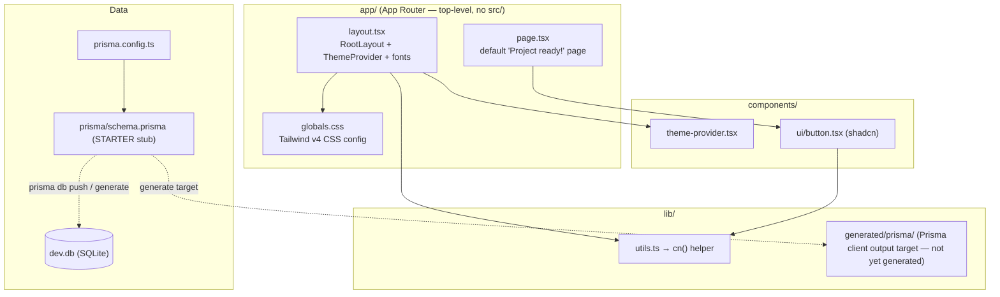
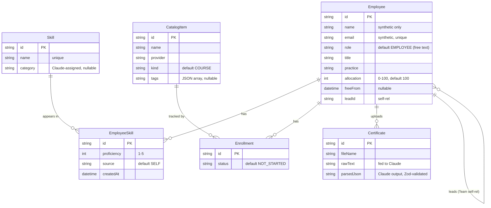

# Current State — Page 02: Service Interactions & Component Architecture

**Initiative:** `skillsync-vertex-hackathon` · **Stage:** 03-architecture / current-state · **Version:** v1
**Mode:** CURRENT-STATE · **Classification:** GREENFIELD · **Evidence:** direct_scan (LightRAG/Dynatrace unavailable)
**Branding:** NULogic. **Data:** Synthetic only — no PII.

> **Honesty note.** There are **no services and no service-to-service interactions** in the codebase today. There are no API route handlers (`find app -name route.ts` → none), no server actions, no Claude client, no auth flow, and no data-access layer beyond the generated Prisma client target. This page therefore documents (a) the **actual scaffold structure** that exists, and (b) the **intended interaction model** the PRD requires, with every "intended" arrow flagged as a gap for Page 04. `has_ui = true` (UFE-class web app), so the frontend/UX section is included.

---

## 1. Current Component Map (what actually exists)



**Evidence for each node:**

| Component | File | What it does today |
|---|---|---|
| RootLayout | `app/layout.tsx:14-30` | Wraps children in `ThemeProvider`; loads Inter + Geist_Mono fonts; sets `suppressHydrationWarning` |
| Home page | `app/page.tsx:3-19` | Renders the default scaffold "Project ready!" page with one demo `Button` |
| ThemeProvider | `components/theme-provider.tsx` | next-themes wrapper (dark-mode toggle) |
| Button | `components/ui/button.tsx` | The single shadcn/ui component added so far |
| `cn()` | `lib/utils.ts:4-6` | clsx + tailwind-merge class combiner |
| Prisma config | `prisma.config.ts:6-14` | Points Prisma at `prisma/schema.prisma`, reads `DATABASE_URL` from env via dotenv |
| Schema | `prisma/schema.prisma` | Starter data model (see §3) |

There is **no routing beyond the index page**, **no `app/api/*`**, and **no module folders** for the Upskilling Tracker or Staffing Matcher.

---

## 2. Intended Service Interactions (PRD target — NOT yet built)

The PRD requires a set of interaction flows, all routed through Next.js server-side handlers (route handlers or server actions) that call the Claude API and persist via Prisma. None exist yet. The intended model:

```mermaid
sequenceDiagram
    participant U as Browser (authenticated employee/manager)
    participant S as Next.js server (route handler / server action) [MISSING]
    participant Z as Zod validator [MISSING]
    participant C as Claude API (@anthropic-ai/sdk) [installed, uncalled]
    participant P as Prisma → SQLite (dev.db)

    Note over U,P: Example — Certificate parse (UC-1, S-01). Entire chain is a gap.
    U->>S: upload cert (multipart)
    S->>C: send file, request {skill,issuer,date,level,confidence}
    C-->>S: JSON
    S->>Z: validate against CertParseSchema
    Z-->>S: ok / fail
    alt valid & confidence high & user confirms
        S->>P: promote/insert EmployeeSkill (state=verified, source=certificate)
        P-->>S: persisted (single canonical record)
        S-->>U: skill confirmed; item → done
    else parse fail / low confidence
        S-->>U: "We couldn't reliably read this certificate…" (no write)
    end
```

### 2.1 Intended interaction inventory (all MISSING)

| Flow | Trigger | Claude call | Persistence | Test scenario |
|---|---|---|---|---|
| Google sign-in (NULogic-only) | Sign-in action | — | session ↔ synthetic profile via synthetic-handle map | S-15, S-16 |
| Session expiry / re-auth | protected request on stale session | — | redirect; no stale write | S-24 |
| Certificate parse | cert upload | cert → skills JSON | promote/insert `EmployeeSkill` verified | S-01..S-03 |
| Resume parse | resume upload | resume → profile JSON | pre-populate baseline skills (self-reported) | S-20, S-21 |
| Staffing match | plain-English search | dataset+query → ranked shortlist | read-only over profiles | S-04..S-07 |
| The loop | re-run search after cert | re-rank | reads promoted record | S-08 |
| Catalog add | add item by name | de-dupe/tag/enrich | merge/insert `CatalogItem` | S-09, S-10 |
| Recommendations | tracker empty-state | recommend items | read profile+gaps | S-11 |
| Plan validation | finalize plan | — (constraint reuses `aiEnabled` tag) | mark plan complete | S-26 |
| Team progress | open progress view | summarize | read scoped profiles | S-13 |
| Self-service skill add | profile edit | — | insert `EmployeeSkill` self-reported | S-18 |
| Manager approval | approve action | — | promote `self-reported → manager-approved` | S-19 |
| Admin role assign | role override | — | update `Employee.role` | S-25 |
| Endorsed flag | manager toggle | — | set/unset endorsed on `CatalogItem` | S-27 |

Of these 14 flows, **5 are pure Claude-intelligence flows** (cert, resume, match, catalog de-dupe/tag/enrich, progress summary, recommendations) — all of which `CLAUDE.md` C-1 forbids faking. **0 of 14 are implemented.**

---

## 3. Data Architecture (current STARTER schema vs. PRD requirements)

The only data model that exists is `prisma/schema.prisma`, explicitly labelled a **STARTER stub** (`prisma/schema.prisma:1` — *"SkillSync data model — STARTER stub. Refine from SPEC.md."*). SQLite has no native enums, so role/status/source are modelled as `String` with comments (`prisma/schema.prisma:2`).

### 3.1 Current entities (as-is)



Evidence: `Employee` `prisma/schema.prisma:15-38`; `Skill` `:40-45`; `EmployeeSkill` `:49-60`; `CatalogItem` `:64-72`; `Enrollment` `:76-86`; `Certificate` `:89-97`.

### 3.2 Schema gaps vs. PRD (the schema predates the PRD)

| PRD requirement | Current schema reality | Evidence | Gap → Page 04 |
|---|---|---|---|
| **Three-tier trust state** `self-reported → manager-approved → verified`, one canonical record, promotes in place (BR-18) | `EmployeeSkill.source` is a flat string `"SELF"/"CERTIFICATE"/"CATALOG"`; **no `state`/trust field**, no promotion semantics | `prisma/schema.prisma:48,56` | TD-DATA-01 |
| **Baseline vs. upskilling-acquired** skills distinguished | No `baseline`/`acquired` distinction; only `source` | `prisma/schema.prisma:49-60` | TD-DATA-01 |
| **Manager-approved** state distinct from cert-verified | Not modelled | — | TD-DATA-01 |
| **Resume** model + extraction storage | **No `Resume` model**; only `Certificate` | `prisma/schema.prisma:89-97` | TD-DATA-02 |
| **Catalog `aiEnabled` tag** used by plan validation (BR-11) | `CatalogItem.tags` is an untyped JSON string; no explicit `aiEnabled` flag/column | `prisma/schema.prisma:69` | TD-DATA-03 |
| **Manager `endorsed` flag** (BR-22) | Not present on `CatalogItem` | `prisma/schema.prisma:64-72` | TD-DATA-03 |
| **Synthetic-handle ↔ profile mapping** for OAuth (BR-13a, deterministic) | `Employee.email` exists but is the synthetic identity; **no separate synthetic-handle / external-subject mapping** | `prisma/schema.prisma:18` | TD-AUTH-02 |
| **Timezone / location, seniority level** (for IST-overlap matching, S-04) | `practice`, `title` exist; **no timezone/location, no seniority level** | `prisma/schema.prisma:21-22` | TD-DATA-04 |
| **Idempotency keys** for cert/resume double-submit (BR-19) | No upload hash / idempotency column | `prisma/schema.prisma:89-97` | TD-DATA-05 |
| **Confidence threshold** persistence for parse acceptance | `parsedJson` stores Claude output but no confidence/threshold modelling | `prisma/schema.prisma:96` | minor, folded into TD-CERT |
| **Migrations** | No `prisma/migrations/` dir; provider drives `db push` only | `find prisma/migrations` → absent; `prisma.config.ts:9-11` declares a migrations path | TD-DATA-06 |

> **Migration mode caveat.** `prisma.config.ts:8-11` declares a `migrations.path`, but **no migrations exist** and `package.json:15` wires only `db:push` (`prisma db push`), which is schema-sync without migration history. For a hackathon this is acceptable; it is noted as operational debt (TD-DATA-06).

### 3.3 Privacy / data-governance posture

- Schema fields are annotated *"synthetic only — never real PII"* (`prisma/schema.prisma:16,18`). This is a comment, **not an enforced constraint** — there is no validation preventing real data entry.
- `.gitignore` excludes `*.db`, `*.db-journal`, and `.env*` (keeping the example), so the SQLite file and secrets are not committed.
- **No seed data exists** to audit for PII compliance (S-14); `package.json:18` `seed` script is a `TODO` stub that exits 1.

---

## 4. Integration Patterns (current)

There are **no integration patterns in code** — no HTTP clients, no event/messaging, no Kafka, no Feign-equivalents, no GraphQL. This is a self-contained app (repository-discovery.v1.json rationale). The only **planned** integrations are:

| Integration | Pattern (intended) | Status | Evidence |
|---|---|---|---|
| Claude API | Server-side SDK calls, JSON response, Zod-validated, prompt-cached (PRD §9 cost) | SDK installed, **0 calls** | `package.json:21`; no usage in `lib/`/`app/` |
| Google OAuth | OAuth 2.0 / OIDC redirect with hosted-domain `hd` check | **No library, no flow** | no auth dep in `package.json` |
| Prisma → SQLite | Local file datasource via generated client | config present, client **not yet generated** | `prisma.config.ts`; `lib/generated/prisma` is git-ignored output target (`.gitignore`) |

> **Prompt/intelligence organization.** `CLAUDE.md` mandates prompts live in `src/prompts/` as named templates and that Claude returns Zod-validated JSON. Neither `src/prompts/` nor any Zod schema exists today — see TD-AI-01/02 on Page 04.

---

## 5. Frontend / UX Patterns (`has_ui = true`)

### 5.1 Current frontend state

| Aspect | Current state | Evidence |
|---|---|---|
| Framework | Next.js 16.2.6 App Router, RSC-enabled | `package.json:26`; `app/layout.tsx` is a server component |
| Styling | Tailwind v4, **CSS-based config** (no `tailwind.config.*`); `@tailwindcss/postcss` | `app/globals.css`; `postcss.config.mjs`; `package.json:37` |
| Design system | shadcn/ui, style `radix-lyra`, `neutral` base, CSS variables, `lucide` icons | `components.json`; only `components/ui/button.tsx` exists |
| Theming | Dark/light via `next-themes` `ThemeProvider` | `components/theme-provider.tsx`; `app/layout.tsx:25` |
| Fonts | Inter (`--font-sans`) + Geist Mono (`--font-mono`) | `app/layout.tsx:1-11` |
| Pages/screens | **One** — the default scaffold landing page | `app/page.tsx` |
| State handling | None (no client state, no data fetching) | n/a |
| Accessibility | Default scaffold only; `suppressHydrationWarning` set for theme | `app/layout.tsx:21` |
| NULogic branding | **Absent** — generic scaffold copy ("Project ready!") | `app/page.tsx:8-9` |

### 5.2 Missing UI surfaces (all required by PRD, none built)

The PRD/SPEC require, at minimum, these screens — **none exist**:

- Sign-in screen (Google button, NULogic-restricted; rejection message) — UC-6.
- Employee profile (baseline skills, self-service add/update, availability) — UC-7.
- Upskilling Tracker (catalog browse, plan assembly + validation, progress, cert upload, recommendations, empty-state) — UC-1, UC-5.
- Resume upload + extraction-confirm UI — UC-9.
- Staffing Matcher (plain-English search box, ranked shortlist with rationale/gaps, partial-quantity note, error state) — UC-2.
- Manager approval queue — UC-8.
- Team progress / compliance view (scoped) — UC-4.
- Admin role-assignment view — UC-10.
- Catalog management incl. manager endorsed-flag toggle — UC-5.
- Role view-switcher (demo aid) — optional, on top of auth.

> **UX designs:** PRD §7 marks Figma designs "in progress — not provided at PRD time." UI is "minimal clean." Downstream design inherits "UX designs in progress."

### 5.3 Frontend gaps → Page 04

Every screen above is net-new (TD-UI-01). Branding application (NULogic) is TD-UI-02. No component library beyond `button` is built (TD-UI-03).

---

## 6. Summary

- **Existing interactions:** only intra-scaffold (layout → theme/fonts, page → button, all → `cn()`), plus Prisma-config → schema. No service-to-service, no external integrations active.
- **Data model:** a STARTER Prisma schema that materially **lags the PRD** — missing the trust-state machine, baseline/verified split, resume model, `aiEnabled`/`endorsed` columns, OAuth handle mapping, timezone/seniority, and idempotency keys.
- **Frontend:** a single default page; every product screen is unbuilt.
- All meaningful interactions are deferred to Page 04 as build-out gaps.
