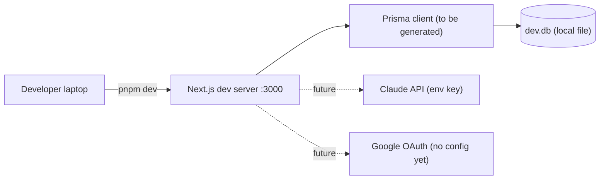

# Current State — Page 03: Tech Stack & Quality Attributes

**Initiative:** `skillsync-vertex-hackathon` · **Stage:** 03-architecture / current-state · **Version:** v1
**Mode:** CURRENT-STATE · **Classification:** GREENFIELD · **Evidence:** direct_scan
**Dynatrace:** unavailable (local-only learning env) → performance metrics are **to be defined** (no production telemetry exists; nothing is deployed).
**Branding:** NULogic. **Data:** Synthetic only — no PII.

> Every version below is grounded in `package.json` (the lockfile `pnpm-lock.yaml` is the source of resolved versions; ranges shown are the declared specifiers).

---

## 1. Installed Tech Stack (verified against `package.json`)

### 1.1 Runtime & framework

| Technology | Declared version | Role | Evidence |
|---|---|---|---|
| **Next.js** | `16.2.6` | App Router framework (web app + server handlers) | `package.json:26` |
| **React** | `19.2.4` | UI runtime | `package.json:29` |
| **React DOM** | `19.2.4` | DOM renderer | `package.json:30` |
| **TypeScript** | `^5` | Language | `package.json:48` |
| **Node types** | `^20` | Node typings | `package.json:40` |
| Module system | ESM (`"type": "module"`) | — | `package.json:4` |

> **⚠️ Next.js 16 caution (governance).** `AGENTS.md:2-4` and `CLAUDE.md` warn this is **not the Next.js in the model's training data** — APIs, conventions, and file structure may differ; **read `node_modules/next/dist/docs/` before writing App Router code** and heed deprecation notices. This is a standing constraint for all downstream implementation.

### 1.2 UI / styling

| Technology | Version | Role | Evidence |
|---|---|---|---|
| Tailwind CSS | `^4` | Styling (CSS-based config, no `tailwind.config.*`) | `package.json:47`; `app/globals.css` |
| `@tailwindcss/postcss` | `^4` | PostCSS integration | `package.json:37`; `postcss.config.mjs` |
| shadcn (CLI) | `^4.10.0` | Component generator | `package.json:31`; `components.json` |
| `radix-ui` | `^1.4.3` | Headless primitives | `package.json:28` |
| `lucide-react` | `^1.17.0` | Icons | `package.json:27` |
| `class-variance-authority` | `^0.7.1` | Variant styling | `package.json:23` |
| `clsx` | `^2.1.1` | Class composition | `package.json:24`; used in `lib/utils.ts:1` |
| `tailwind-merge` | `^3.6.0` | Class merge | `package.json:33`; `lib/utils.ts:2` |
| `tw-animate-css` | `^1.4.0` | Animations | `package.json:34` |
| `next-themes` | `^0.4.6` | Dark/light theming | `package.json:27`; `components/theme-provider.tsx` |

### 1.3 Data layer

| Technology | Version | Role | Evidence |
|---|---|---|---|
| **Prisma** (CLI) | `^7.8.0` | ORM / migrations tooling | `package.json:46` |
| **`@prisma/client`** | `^7.8.0` | Generated client | `package.json:22`; output target `lib/generated/prisma` (`prisma/schema.prisma:6`) |
| **SQLite** | (file `dev.db`) | Datasource | `prisma/schema.prisma:9-11`; `.env.example:7` `DATABASE_URL="file:./dev.db"` |
| `dotenv` | `^17.4.2` | Env loading for Prisma config | `package.json:41`; `prisma.config.ts:3` |

### 1.4 AI / intelligence

| Technology | Version | Role | Evidence |
|---|---|---|---|
| **`@anthropic-ai/sdk`** | `^0.100.1` | ALL Claude calls (cert/resume parse, match, catalog, summary) | `package.json:21` |
| `ANTHROPIC_API_KEY` | env | API auth | `.env.example:4` (`"[REDACTED]"`) |

> The SDK is installed but **has zero call sites** — no `import` of `@anthropic-ai/sdk` exists anywhere in `app/`, `components/`, `lib/`, or `hooks/`. The intelligence layer is entirely unbuilt.

### 1.5 Validation, testing, tooling

| Technology | Version | Role | Evidence |
|---|---|---|---|
| **Zod** | `^4.4.3` | Structured-output validation (mandated before any write) | `package.json:35` |
| **Vitest** | `^4.1.8` | Test runner | `package.json:49`; scripts `test`/`test:watch` (`package.json:13-14`) |
| ESLint | `^9` + `eslint-config-next` `16.2.6` | Lint | `package.json:42,44`; `eslint.config.mjs` |
| Prettier | `^3.8.3` + `prettier-plugin-tailwindcss` `^0.8.0` | Format | `package.json:45,46` |
| pnpm | (workspace) | Package manager | `pnpm-lock.yaml`, `pnpm-workspace.yaml` |

> **Note vs. `CLAUDE.md`.** `CLAUDE.md` states `@anthropic-ai/sdk`, Prisma, and a test runner are "not yet installed" and there is "no `prisma/` dir." **The actual repo contradicts this** — all are installed and `prisma/` exists. The repo has advanced past the doc; this page reflects the **code reality** (evidence-first). `CLAUDE.md` should be reconciled (noted on Page 04 as documentation debt).

---

## 2. Approved-Stack Comparison

Architecture-principles is a **stub** in this learning run (`architecture-principles/README.md`: *"Local learning stub. Real principles live in Fayaz_s docs repo."*), so there is **no approved-stack catalogue to diff against**. The PRD imposes no constraints beyond defaults (PRD §11). Assessment is therefore made against the PRD/SPEC/`CLAUDE.md` intent:

| Area | Observed | PRD/SPEC expectation | Verdict |
|---|---|---|---|
| Framework | Next.js 16 App Router | Single Next.js app (PRD §4) | ✅ aligned |
| AI provider | `@anthropic-ai/sdk` | All intelligence via Claude API (C-1) | ✅ aligned (unused) |
| Data store | Prisma + SQLite | "Prisma + SQLite data store" (PRD §7) | ✅ aligned |
| Validation | Zod | "Zod-validated before use" (C-3) | ✅ aligned (unused) |
| Test runner | Vitest | "single-file test command … cert-parsing tests" (`CLAUDE.md`) | ✅ runner present; **no tests, no config** |
| Auth | **none** | Real Google OAuth, NULogic-restricted (C-5) | ❌ missing entirely |

---

## 3. Quality Attributes (NFRs) — current posture

> Greenfield: nothing is deployed, so runtime NFRs (performance, availability) have **no measurable baseline**. Posture below is "design-readiness": does the scaffold give us the tools to meet each NFR?

### 3.1 Performance & scalability

- **No telemetry, nothing deployed → performance metrics to be defined.** Dynatrace unavailable.
- Target (PRD §9): staffing search returns interactively with a loading state. Current scaffold has no search, no loading states.
- Cost efficiency (PRD §9): prompt caching, Sonnet-for-routine / Opus-for-hard, cached profile dataset across queries. **Not implemented** — no Claude calls. Zod and SDK present to enable this.

### 3.2 Reliability & data integrity

| NFR (PRD §9) | Current posture | Evidence |
|---|---|---|
| 100% of model outputs Zod-validated before any write | **Not met** (no Claude calls, no Zod schemas) — but Zod installed | `package.json:35` |
| Failed/low-confidence parse never writes a skill | **Not met** (no parse code) | — |
| One canonical skill record; promote-in-place; idempotent uploads | **Not met** — schema has no trust-state/idempotency support | `prisma/schema.prisma:49-60,89-97` |
| Each Claude flow degrades gracefully (no crash) | **Not met** (no flows) | — |

### 3.3 Security & privacy

| NFR | Current posture | Evidence |
|---|---|---|
| Synthetic data only; no real PII in repo/DB/fixtures | **Structurally supported** — schema comments mandate synthetic; `.gitignore` excludes `*.db`, `*.db-journal`, `.env*` | `prisma/schema.prisma:16,18`; `.gitignore` |
| Real Google OAuth, NULogic-restricted, non-NULogic rejected | **Not met** — no auth | no auth dep `package.json` |
| Secrets from env, never committed | **Met for Claude/DB** (`ANTHROPIC_API_KEY`, `DATABASE_URL` env-sourced; `.env*` ignored); **OAuth secrets env slots missing** | `.env.example:1-8`; `prisma.config.ts:12`; `.gitignore` |
| Role-based data scoping / approval authority | **Not met** — `role` field exists but no enforcement | `prisma/schema.prisma:18-19` |
| Auth resilience (expired session redirect, no stale write) | **Not met** | — |

> **Secrets-handling spot check (S-14 relevance):** `.env.example:4` uses the `[REDACTED]` placeholder for the API key — correct discipline. The real `.env` exists locally and is git-ignored (`.gitignore` `.env*`). No secret is hardcoded in any source file inspected.

### 3.4 Observability

- PRD §9 wants each Claude call boundary to log request id + validation outcome. **No logging infrastructure and no Claude boundary exist.** No APM/Dynatrace.

### 3.5 Testing posture

| Aspect | Current | Evidence |
|---|---|---|
| Runner | Vitest installed; `test` = `vitest run`, `test:watch` = `vitest` | `package.json:13-14,49` |
| Config | **No `vitest.config.*`** | `ls vitest.config.*` → none |
| Tests written | **None** | `find … -name '*.test.ts'` → none |
| Test scenarios defined | 27 scenarios (S-01..S-27) authored in `02-acceptance-tests/test-scenarios.md`, state = RED (all fail, no impl) | acceptance-tests artifact |
| Single-file test command | **Not yet added** (`CLAUDE.md` asks for one) | `package.json:6-18` |
| Fixtures | `fixtures/certs/` and `fixtures/resumes/` **do not exist** | `ls fixtures` → none |

### 3.6 Deployment & infrastructure

- **No deployment configuration** (no Dockerfile, no CI workflow inspected, no hosting config). Demo runs locally via `pnpm dev` (`package.json:7`).
- DB is a local SQLite file applied via `pnpm db:push` (`package.json:15`); no migration history (TD-DATA-06).
- Local-only, env unset, no git push (per task constraints).

---

## 4. Tech-Stack Summary

The scaffold has **assembled the right toolbox**: Next.js 16 + React 19 + TS + Tailwind v4 + shadcn for the UI; Prisma + SQLite for data; `@anthropic-ai/sdk` + Zod for validated intelligence; Vitest for tests; pnpm + ESLint + Prettier for tooling. **The toolbox is unused** — no feature code, no auth, no Claude calls, no tests, no fixtures, and a starter schema that trails the PRD. Two stack-level holes stand out: **(1) no auth library** for the now-mandatory Google OAuth, and **(2) no test configuration/tests** despite a runner and 27 authored scenarios. Both are carried into Page 04.
