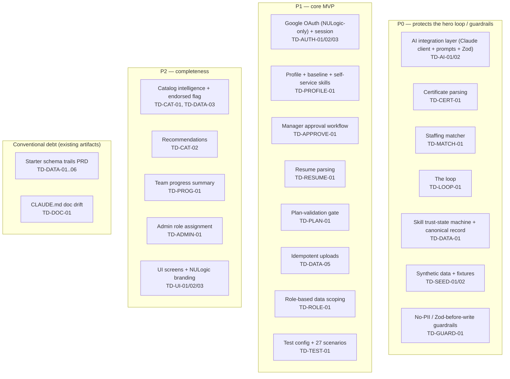
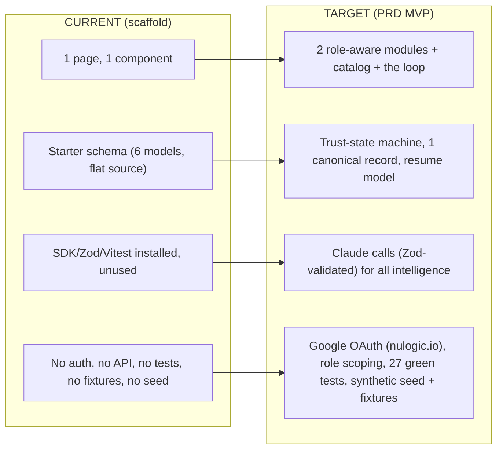

# Current State — Page 04: Gap Analysis & Build-Out Plan

**Initiative:** `skillsync-vertex-hackathon` · **Stage:** 03-architecture / current-state · **Version:** v1
**Mode:** CURRENT-STATE · **Classification:** GREENFIELD · **Evidence:** direct_scan
**Branding:** NULogic. **Data:** Synthetic only — no PII.

> **This is the load-bearing page.** Because the product is greenfield, **almost everything in the PRD is a gap** — net-new work, not modernization of existing code. The few items below that are *technical debt in the conventional sense* are the **STARTER Prisma schema** (which trails the PRD) and **doc drift** in `CLAUDE.md`. Everything else is a **build gap**. T-shirt sizing follows agile standards; **no calendar dates** are used. Each gap has a stable `TD-XXX` id for downstream story creation.

---

## 1. Gap Heat Map (build-out, not legacy debt)

---

## 2. Gap Register (full enumeration)

Legend — **Severity:** how much it threatens the demo. **Size:** XS/S/M/L/XL (agile T-shirt). **Layer:** AI / Data / Auth / Feature / UI / Test / Ops / Doc.

### 2.1 Intelligence layer (P0 — gates the hero)

| ID | Gap | Severity | Size | Evidence (absence) |
|---|---|---|---|---|
| **TD-AI-01** | **No Claude client / call-boundary wrapper.** SDK installed but zero call sites; need a thin server-side client with logging (request id + validation outcome), model selection (Sonnet routine / Opus hard), and prompt caching for the profile dataset/system prompt. | High | M | `@anthropic-ai/sdk` at `package.json:21`; no import anywhere |
| **TD-AI-02** | **No `src/prompts/` and no Zod schemas.** `CLAUDE.md` mandates named prompt templates in `src/prompts/` and Zod validation before any write; neither exists. | High | M | `ls src/prompts` → none; no Zod schema files; `zod` at `package.json:35` unused |

### 2.2 Hero-loop features (P0)

| ID | Gap | Severity | Size | Evidence / scenario |
|---|---|---|---|---|
| **TD-CERT-01** | **Certificate parsing** — upload → Claude → `{skill,issuer,date,level,confidence}` → Zod → confirm → write verified skill; low-confidence/parse-fail writes nothing with the specified user message. Riskiest + hero per `CLAUDE.md` build order. | Critical | L | S-01..S-03; no cert flow; `Certificate` model exists `prisma/schema.prisma:89-97` but unused |
| **TD-MATCH-01** | **Staffing matcher** — plain-English query → Claude availability-aware ranked shortlist (`matchPercent`, `matchedSkills`, `gaps`, `availability`, `rationale`); hard-match (closest+gaps), partial-quantity shortfall note, error state. Must reason over `freeFrom`/allocation, not just skills. | Critical | L | S-04..S-07; no matcher code; `allocation`/`freeFrom` fields exist `prisma/schema.prisma:24-25` |
| **TD-LOOP-01** | **The loop (hero)** — re-run same search after cert promotes a skill; ranking visibly improves; guard against duplicate-row failure signature. Depends on TD-CERT-01, TD-MATCH-01, TD-DATA-01. | Critical | M | S-08; depends on above |

### 2.3 Skill state machine & data model (P0/P1 — conventional debt + build)

| ID | Gap | Severity | Size | Evidence |
|---|---|---|---|---|
| **TD-DATA-01** | **Skill trust-state machine + single canonical record.** Add a trust `state` (`self-reported → manager-approved → verified`) that **promotes in place** and never duplicates a skill row; distinguish baseline vs. acquired. Current `EmployeeSkill` has only a flat `source` string. | Critical | M | `prisma/schema.prisma:48,56`; S-22 |
| **TD-DATA-02** | **Resume model.** No entity to store resume upload + parsed JSON; only `Certificate` exists. | Med | S | `prisma/schema.prisma:89-97`; S-20 |
| **TD-DATA-03** | **Catalog `aiEnabled` + `endorsed` columns.** `tags` is an untyped JSON string; plan validation (BR-11) needs a reliable `aiEnabled` signal; manager endorsement (BR-22) needs an `endorsed` flag. | Med | S | `prisma/schema.prisma:64-72`; S-26, S-27 |
| **TD-DATA-04** | **Profile fields for matching:** timezone/location (IST-overlap query) and seniority level absent. | Med | S | `prisma/schema.prisma:21-22`; S-04 |
| **TD-DATA-05** | **Idempotency keys** for cert/resume double-submit; no upload hash/dedupe column. | Med | S | `prisma/schema.prisma:89-97`; S-23 |
| **TD-DATA-06** | **No migration history.** Only `db:push` wired; `migrations.path` declared but empty. Acceptable for hackathon; operational debt. | Low | XS | `prisma.config.ts:9-11`; `package.json:15`; no `prisma/migrations/` |

### 2.4 Authentication & authorization (P1 — the post-gate addition)

| ID | Gap | Severity | Size | Evidence |
|---|---|---|---|---|
| **TD-AUTH-01** | **Real Google OAuth, NULogic-restricted.** No auth library (NextAuth/Auth.js-style), no sign-in flow, no hosted-domain (`nulogic.io`) check, no rejection path. Supersedes the SPEC/`CLAUDE.md` fake-auth stance. | High | L | no auth dep `package.json:20-50`; S-15, S-16 |
| **TD-AUTH-02** | **Deterministic synthetic-handle ↔ profile mapping** (BR-13a); real email used only transiently for the domain check, never stored. No mapping table/seed. | High | S | `prisma/schema.prisma:18`; S-15 |
| **TD-AUTH-03** | **Session expiry / re-auth handling** — protected routes redirect to sign-in on stale session; no stale write; in-flight work handled gracefully. No middleware. | Med | S | no middleware; S-24 |
| **TD-AUTH-04** | **OAuth env vars missing from `.env.example`** (Google client id/secret, auth secret). | Low | XS | `.env.example:1-8` declares only `ANTHROPIC_API_KEY`, `DATABASE_URL` |
| **TD-ROLE-01** | **Role-based data scoping & approval authority.** `role` field exists but nothing enforces scoping (Practice Lead → own team; Employee → no matcher; manager approval authority). | High | M | `prisma/schema.prisma:18-19,28-30`; S-12, S-19 |

### 2.5 Profile & self-service (P1)

| ID | Gap | Severity | Size | Evidence |
|---|---|---|---|---|
| **TD-PROFILE-01** | **Baseline skill capture + employee self-service add/update** (`source=self-reported, state=self-reported`), inline validation rejecting blanks. Plus current project + allocation/availability surfaced. | High | M | S-16, S-17, S-18; fields partial in schema |
| **TD-APPROVE-01** | **Manager approval workflow** — review queue; promote `self-reported → manager-approved`; deny unauthorized approvers. | Med | M | S-19; depends on TD-DATA-01, TD-ROLE-01 |
| **TD-RESUME-01** | **Resume upload + Claude extraction** — file → Claude → `{currentProject, allocation, baselineSkills[]}` → Zod → confirm → pre-populate (self-reported); parse-fail writes nothing with specified message. | Med | L | S-20, S-21; depends on TD-AI-01/02, TD-DATA-02 |

### 2.6 Upskilling, catalog, progress, admin (P1/P2)

| ID | Gap | Severity | Size | Evidence |
|---|---|---|---|---|
| **TD-PLAN-01** | **Plan-validation gate** — finalize requires ≥2 items incl. ≥1 AI-enabled; specific rejection messages; remove/swap-and-retry. Constraint reuses `aiEnabled` tag (not new intelligence). | Med | M | S-26; needs TD-DATA-03 |
| **TD-CAT-01** | **Catalog intelligence** — add-by-name → Claude de-dupe/normalize (merge into canonical), auto-tag (incl. `aiEnabled`), enrich; enrichment failure → `enrichmentPending`, never blocks add. Plus manager `endorsed` toggle (set/unset, non-manager denied, endorsed surfaced). | Med | L | S-09, S-10, S-27; needs TD-AI, TD-DATA-03 |
| **TD-CAT-02** | **Per-employee recommendations** via Claude (role/team/skills/gaps), Zod-validated; powers tracker empty-state. | Low | M | S-11 |
| **TD-PROG-01** | **Team progress / compliance summary** via Claude, scoped to viewer; empty-state copy. Live % vs 2–3/year target (gated by plan validation). | Low | M | S-13; PRD §8 |
| **TD-ADMIN-01** | **Admin role assignment** — assign/override role; re-scope access; non-Admin denied; only Admin management capability in MVP. | Low | S | S-25 |

### 2.7 Frontend / UX (P2)

| ID | Gap | Severity | Size | Evidence |
|---|---|---|---|---|
| **TD-UI-01** | **All product screens** (sign-in, profile, tracker, resume upload, matcher, approval queue, progress, admin, catalog, role view-switcher). Only the default scaffold page exists. | High | XL | `app/page.tsx` is the lone page |
| **TD-UI-02** | **NULogic branding** — generic scaffold copy ("Project ready!"); branding mandated by org instructions + `CLAUDE.md`. | Low | S | `app/page.tsx:8-9` |
| **TD-UI-03** | **Component library** — only `button` scaffolded; need form/table/dialog/upload/badge etc. via `pnpm dlx shadcn add`. | Med | M | `components/ui/` has only `button.tsx` |

### 2.8 Test, ops & doc debt

| ID | Gap | Severity | Size | Evidence |
|---|---|---|---|---|
| **TD-TEST-01** | **No test config and no tests** despite Vitest + 27 authored RED scenarios; need `vitest.config`, a single-file test command, and tests against `fixtures/certs/`/`fixtures/resumes/`. | High | M | no `vitest.config.*`; no `*.test.ts`; `package.json:13-14`; acceptance-tests artifact |
| **TD-SEED-01** | **Synthetic-data seed not implemented** — `seed` script is a `TODO` that exits 1; need ~20–25 synthetic profiles with skills/allocation/`freeFrom`, no PII. | Critical | M | `package.json:18`; S-04, S-14 |
| **TD-SEED-02** | **Fixtures absent** — `fixtures/certs/` and `fixtures/resumes/` do not exist; required for cert/resume parse tests and the demo. | High | S | `ls fixtures` → none; S-01, S-20 |
| **TD-GUARD-01** | **Guardrails unverified** — no seed/fixtures to audit for PII; no Zod-before-write enforcement yet; secrets discipline is in place for Claude/DB but OAuth secrets not modelled. | High | S | S-14; `.env.example`; `.gitignore` |
| **TD-DOC-01** | **`CLAUDE.md` doc drift** — states SDK/Prisma/test-runner "not installed" and "no `prisma/` dir," but all are installed and `prisma/` exists. Reconcile to avoid misleading downstream work. | Low | XS | `CLAUDE.md` "Current state" vs `package.json:20-50`, `prisma/schema.prisma` |

---

## 3. Gap Summary by Layer

| Layer | Gap count | Sizes |
|---|---|---|
| AI / intelligence | 2 | M, M |
| Hero-loop features | 3 | L, L, M |
| Data model | 6 | M, S, S, S, S, XS |
| Auth / authz | 5 | L, S, S, XS, M |
| Profile / self-service | 3 | M, M, L |
| Upskilling / catalog / progress / admin | 5 | M, L, M, M, S |
| Frontend / UX | 3 | XL, S, M |
| Test / ops / doc / seed / guardrails | 5 | M, M, S, S, XS |
| **Total** | **32** | — |

---

## 4. Current vs. Target

---

## 5. Recommended Build Phasing (honors `CLAUDE.md` de-risked order)

> No calendar dates — sequencing only. Protect the hero loop above completeness.

1. **Foundation:** TD-SEED-01/02, TD-DATA-01..05 (schema to match PRD), TD-AI-01/02, TD-TEST-01, TD-GUARD-01.
2. **Hero risk first:** TD-CERT-01 → TD-MATCH-01 → TD-LOOP-01.
3. **Profile spine:** TD-PROFILE-01, TD-RESUME-01, TD-APPROVE-01.
4. **Catalog & plan:** TD-CAT-01/02, TD-PLAN-01.
5. **Roles & auth:** TD-AUTH-01..04, TD-ROLE-01, TD-ADMIN-01, TD-PROG-01.
6. **UI & branding:** TD-UI-01..03 (+ role view-switcher demo aid).
7. **Freeze + polish** the end-to-end demo. Reconcile TD-DOC-01.

---

## 6. Gap-Analysis Summary

There are **32 enumerated gaps**. None are legacy-system modernization in the usual sense; the only conventional debt is the **STARTER schema trailing the PRD** (TD-DATA-01..06) and **doc drift** (TD-DOC-01). The critical path is the **AI layer → cert parse → matcher → the loop**, sitting on a **synthetic seed + fixtures** and a **trust-state data model**, guarded by **Zod-before-write** and **no-PII** rules. The largest single lift is the **UI build-out** (TD-UI-01, XL). The biggest *new* scope beyond the original SPEC is **real Google OAuth + role scoping** (TD-AUTH-*, TD-ROLE-01), which the post-gate PRD revision added and which supersedes the prior fake-auth stance.
