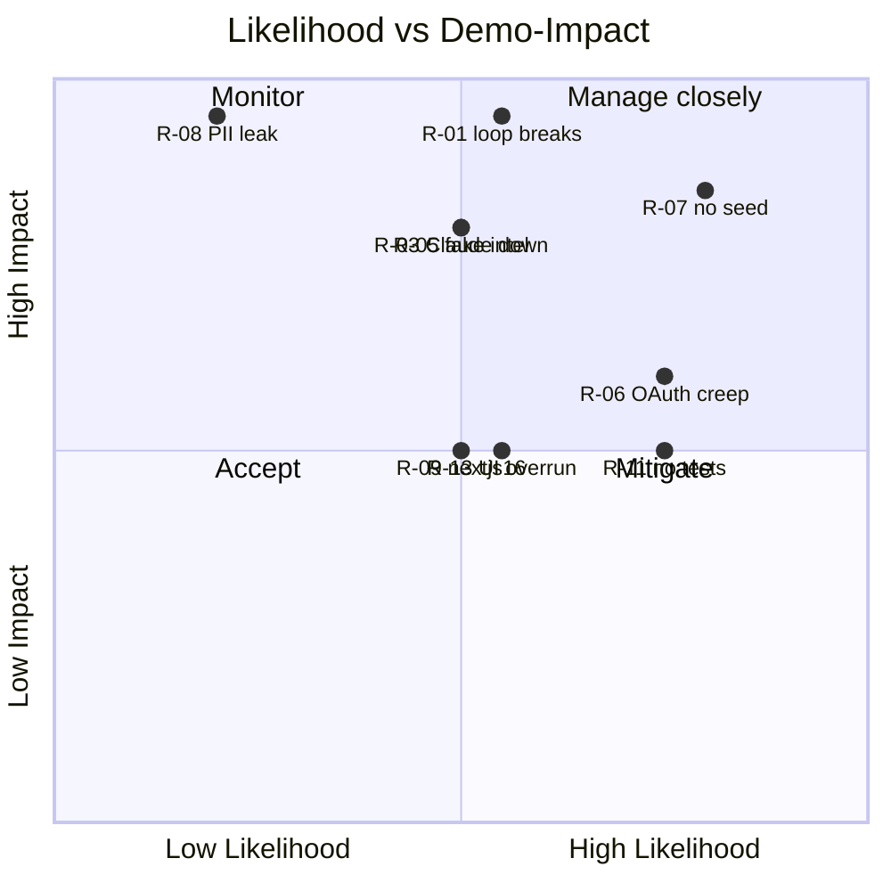

# Current State — Page 05: Risk Assessment

**Initiative:** `skillsync-vertex-hackathon` · **Stage:** 03-architecture / current-state · **Version:** v1
**Mode:** CURRENT-STATE · **Classification:** GREENFIELD · **Evidence:** direct_scan
**Branding:** NULogic. **Data:** Synthetic only — no PII.

> Greenfield + time-boxed hackathon. The dominant risks are **delivery/scope risk** (build everything in a tight window) and **demo-integrity risk** (the hero loop must not break on stage), not legacy-migration risk. Severity = Likelihood × Demo-impact.

---

## 1. Risk Register

| ID | Risk | Likelihood | Impact | Severity | Linked gaps |
|---|---|---|---|---|---|
| **R-01** | **Hero loop breaks live.** Cert parse, single-record promotion, or re-match fails on stage; the before/after comparison doesn't visibly improve. | Med | Critical | **High** | TD-CERT-01, TD-LOOP-01, TD-DATA-01 |
| **R-02** | **Duplicate-skill-row failure signature.** A cert for an already-self-reported skill creates a new row instead of promoting in place, muddying the loop comparison. | Med | High | **High** | TD-DATA-01, TD-DATA-05 |
| **R-03** | **Claude unavailability / cost / latency.** API down, rate-limited, or slow during the demo window; no caching means token burn. | Med | High | **High** | TD-AI-01 |
| **R-04** | **Invalid model JSON corrupts the store.** Output written without Zod validation; garbage profile data. | Med | High | **High** | TD-AI-02, TD-GUARD-01 |
| **R-05** | **Temptation to fake intelligence** (regex/keyword) to hit a deadline — explicitly forbidden by `CLAUDE.md` C-1; would invalidate the product bet. | Med | High | **High** | TD-CERT-01, TD-MATCH-01, TD-CAT-01 |
| **R-06** | **OAuth scope creep blows the timeline.** Real Google OAuth + hosted-domain + session handling is a late, large addition that can crowd out the hero loop. | High | Med | **High** | TD-AUTH-01..04, TD-ROLE-01 |
| **R-07** | **No synthetic seed / fixtures → nothing to demo.** Seed script is a `TODO` exit-1; `fixtures/` absent. | High | High | **High** | TD-SEED-01/02 |
| **R-08** | **Real PII leaks** into seed, DB, fixtures, or via the OAuth real email. | Low | Critical | **Med** | TD-AUTH-02, TD-GUARD-01 |
| **R-09** | **Next.js 16 breaking changes** — model uses outdated App Router conventions from training data; build/runtime breaks. | Med | Med | **Med** | (cross-cutting) |
| **R-10** | **Schema churn.** Starter schema must be reshaped for the trust-state machine after some code already depends on it. | Med | Med | **Med** | TD-DATA-01..05 |
| **R-11** | **Tests never written.** Runner + 27 RED scenarios exist but no config/tests; regressions go unnoticed near freeze. | High | Med | **Med** | TD-TEST-01 |
| **R-12** | **Secrets committed** (API key / OAuth secret) despite `.env*` ignore. | Low | High | **Med** | TD-AUTH-04, TD-GUARD-01 |
| **R-13** | **UI overrun.** UI is the XL gap; polishing screens eats time better spent protecting the loop. | Med | Med | **Med** | TD-UI-01 |
| **R-14** | **Doc drift misleads builders.** `CLAUDE.md` says deps not installed when they are; wasted effort / wrong assumptions. | Med | Low | **Low** | TD-DOC-01 |
| **R-15** | **Role-scoping gaps** let an Employee reach the matcher or a Practice Lead see other teams in the demo. | Med | Low | **Low** | TD-ROLE-01 |

---

## 2. Risk Heat Map

---

## 3. Top Risks — Mitigations

### R-01 / R-02 — Protect the hero loop & single-record promotion
- Build the trust-state machine (TD-DATA-01) with a **single canonical `EmployeeSkill` per `(employee, skill)`** (`prisma/schema.prisma:59` already has `@@unique([employeeId, skillId])` — extend with a `state` field that only promotes).
- Resolve cert-skill ↔ existing-skill via **Claude semantic de-dupe**, not string equality (S-22), then promote in place.
- Add an e2e test asserting **no duplicate row** after cert promotion (S-08 failure signature).

### R-03 / R-04 / R-05 — Claude reliability, validation, no faking
- Centralize all calls behind one client (TD-AI-01) with timeouts, graceful fallback messages, request-id logging, **prompt caching** of the profile dataset/system prompt (PRD §9 cost).
- **Zod-validate every response before any write** (TD-AI-02); on failure, write nothing and show the PRD's user-facing message.
- Never substitute regex/keyword logic (C-1). If a call is awkward, **stub the boundary with a `TODO`** rather than fake it.

### R-06 — Contain OAuth scope
- Treat the **role view-switcher as the always-available fallback** (PRD §7 dependency note) so role-scoped journeys still demo if OAuth slips.
- Keep OAuth minimal: hosted-domain check + deterministic synthetic-handle mapping + graceful redirect; **no token-refresh/remember-me** (BR-20).

### R-07 — Seed & fixtures first
- Implement `seed` (TD-SEED-01) and create `fixtures/certs/` + `fixtures/resumes/` (TD-SEED-02) as build-order step 1, before cert/match work. Nothing demos without them.

### R-08 / R-12 — PII & secrets
- Synthetic-only seed; OAuth real email used **transiently** for the domain check, never persisted (BR-13a). Map to synthetic profiles by handle.
- Keep secrets in env; `.gitignore` already excludes `.env*` and `*.db`. Add the missing OAuth env slots to `.env.example` with `[REDACTED]` placeholders (TD-AUTH-04). Review seed/fixtures for PII before commit (S-14).

### R-09 — Next.js 16
- Read `node_modules/next/dist/docs/` before writing App Router code (`AGENTS.md`, `CLAUDE.md`); do not trust training-data conventions.

### R-10 / R-11 — Schema churn & tests
- Reshape the schema to match the PRD **early**, before feature code couples to the starter shape.
- Add `vitest.config` + a single-file test command and drive features test-first against the 27 RED scenarios (TD-TEST-01).

---

## 4. Assumptions & Open Items

| Item | Status |
|---|---|
| LightRAG / Dynatrace MCP unavailable → direct_scan; no production telemetry exists | Confirmed (greenfield, local-only) |
| Architecture-principles is a stub → no approved-stack diff possible | Confirmed (`architecture-principles/README.md`) |
| `CLAUDE.md` "current state" section is stale vs. actual repo | Confirmed (deps installed; `prisma/` present) — TD-DOC-01 |
| Figma/UX designs "in progress, not provided" | Per PRD §7; downstream inherits |
| Model selection (Sonnet/Opus) and prompt design | Stage 3/engineering decision; not specified in PRD §4 |
| Greenfield AskUserQuestion gate | Skipped per task directive ("write directly") |

---

## 5. Risk Summary

The program is **delivery- and demo-integrity-bound**, not migration-bound. The three risks that most threaten a successful demo are **(R-07) having no synthetic data to show**, **(R-01/R-02) the hero loop or its single-record promotion failing live**, and **(R-06) late OAuth scope crowding out the loop**. All are mitigable by following the `CLAUDE.md` de-risked build order: **seed/fixtures and the AI+Zod boundary first, hero loop next, OAuth and UI last, with the role view-switcher as a standing fallback.** The non-negotiable guardrails — **Claude-only intelligence, Zod-before-write, synthetic-only/no-PII, secrets-from-env** — are the acceptance bar and must not be traded away under deadline pressure.
