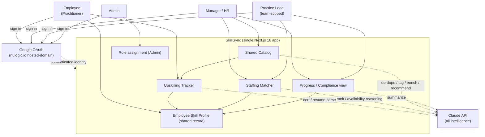
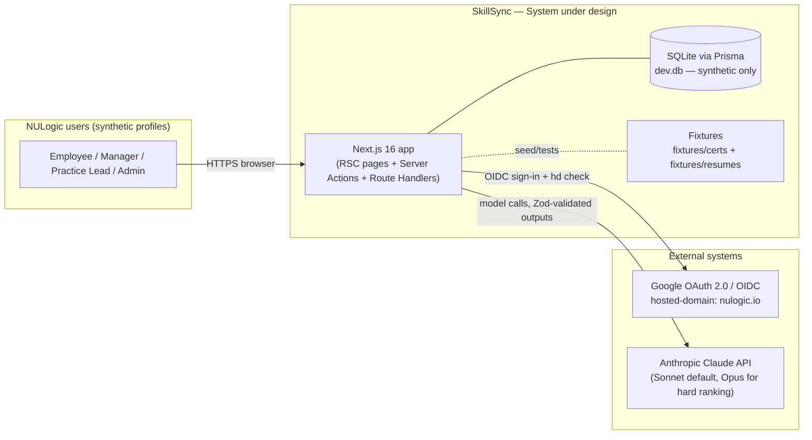
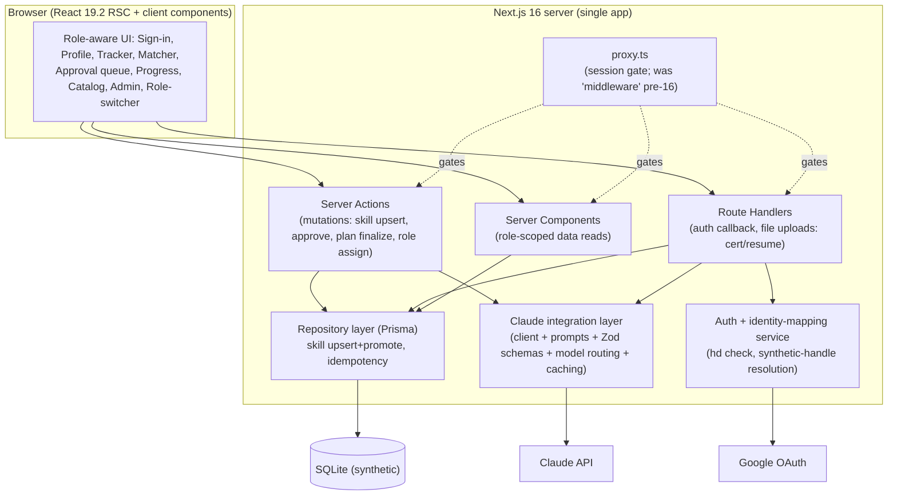

# Target State — Page 01: System Overview

**Initiative:** `skillsync-vertex-hackathon` · **Stage:** 03-architecture / target-state · **Version:** v1
**Mode:** TARGET-STATE · **Classification:** GREENFIELD · **Evidence:** `direct_scan` (LightRAG MCP unavailable this run; single net-new repo — no Nulogic platform services to discover)
**Branding:** NULogic. **Data:** Synthetic only — no real PII anywhere (repo, DB, fixtures), including for authenticated Google users.
**Zero-code policy:** This document contains only Mermaid diagrams and generic `text` pseudo-code. No executable code, configs, or framework-specific snippets.

> **What this page is.** The strategic system overview for the SkillSync MVP: business context, system boundary, the single shared domain (the *living Employee Skill Profile*), the architecture principles that constrain every decision, and the **hero loop** the whole system exists to protect. Pages 02–05 detail the service/API design, data model, roadmap, and ADRs.

> **The one thing to protect.** SkillSync is a demo whose value is one loop: **upload a certificate → the profile's skill record is promoted to `verified` → re-run a staffing search → the candidate visibly moves up the ranking.** Every architectural choice below biases toward keeping that loop working end-to-end and degrading gracefully, over completeness.

---

## 1. Business Context

NULogic is a ~150-person services company running many concurrent client engagements. Two operational processes are manual and disconnected today, and SkillSync exists to connect them through one living data record and the Claude API.

| Problem (today) | Cost of inaction | SkillSync intervention |
|---|---|---|
| **Staffing from memory / stale resumes** — no fast way to ask "who has skill X *and* is free within 2 weeks?" | Time-to-staff in *days*; lost billable time; client-confidence risk | **Staffing Matcher**: plain-English, availability-aware, Claude-ranked shortlist with rationale + gaps (UC-2) |
| **Upskilling tracked in spreadsheets** — 2–3 certs/year mandate with no proof, no link to skill records | Skill data is untrustworthy and stale; gaps never drive learning | **Upskilling Tracker**: catalog plan + certificate upload → Claude-extracted *verified* skills (UC-1) |
| **The two processes never inform each other** | Identified gaps never drive learning; completed learning never sharpens staffing | **The loop (hero)**: gap → recommendation → cert → promoted skill → improved re-match (UC-3) |

**Product bet:** one **living Employee Skill Profile** feeding two role-aware modules, stitched by the loop. All "intelligence" (parsing, ranking, de-dupe, tagging, enrichment, recommendation, summarization) is delegated to the **Claude API** — never faked with regex/keyword/hardcoded logic (BR-09).

### 1.1 Stakeholders / Personas (synthetic archetypes — no real individuals)

| Persona | Role tier | Primary journey | Key system touchpoints |
|---|---|---|---|
| **Employee ("Practitioner")** | Employee (everyone) | Sign in → upload resume → maintain baseline skills → pick plan (≥2 incl. ≥1 AI-enabled) → upload cert | Auth, Profile, Resume parse, Tracker, Cert parse |
| **Manager / HR** | Manager/HR | Sign in → plain-English staffing search → review ranked shortlist + gaps → approve self-reported skills → view org progress | Auth, Matcher, Approval, Progress, Catalog endorse |
| **Practice Lead** | Practice Lead (also an Employee) | See own team's profiles/progress; staff from team; upskill as an Employee | Auth (team-scoped), Matcher (team), Progress (team), Profile |
| **Admin** | Admin | Everything above + assign/override a user's role (the *only* Admin management capability in MVP — BR-21) | Auth, Role assignment, all views |

**Role hierarchy (data-scope precedence):** `Admin > Manager/HR > Practice Lead > Employee`. The role layers **on top of** the authenticated Google identity (BR-03, BR-13). A role view-switcher MAY remain as a demo/testing aid but does **not** replace real auth.

### 1.2 Stakeholder interaction map



---

## 2. System Boundary & Context (C4 Level 1)

SkillSync is a **single Next.js 16 (App Router, RSC) application** with a Prisma/SQLite data store, integrating two external systems: **Google OAuth** (authentication + hosted-domain restriction) and the **Claude API** (all intelligence). There are no other downstream consumers, no HRMS/Jira integration, and no production infra in MVP scope (see `scope-boundary.v1.md` Out-of-Scope).



### 2.1 In / Out of system boundary

| Inside the boundary | Outside the boundary (MVP) |
|---|---|
| Two role-aware modules (Tracker, Matcher), shared Catalog, Progress view, the loop | Real HRMS / Jira / MCP integrations |
| The Employee Skill Profile domain + Prisma/SQLite persistence | Production dashboards, org-wide heatmaps, forecasting |
| Claude integration layer (prompts, schemas, model routing, caching) | Build-vs-hire guidance |
| Google OAuth sign-in + `nulogic.io` hosted-domain restriction + session gating | SSO beyond Google, multi-IdP, account provisioning, RBAC hardening |
| Deterministic identity→synthetic-profile mapping (no real PII) | Admin platform config beyond role assignment (BR-21) |
| Synthetic seed (~20–25 profiles) + cert/resume fixtures | Session-management hardening (token refresh, remember-me, idle policy) |

---

## 3. Architecture Principles (the constraints behind every decision)

These principles are derived from `CLAUDE.md`, NULogic org instructions, the PRD, and the business rules. They are **non-negotiable** and are traced into Pages 02–05.

### P1 — All intelligence flows through the Claude API (BR-09)
Certificate parsing, resume parsing, matching/ranking, availability reasoning, catalog de-dupe/tag/enrich/recommend, skill-identity semantic resolution, and progress summarization are **Claude calls returning structured JSON**. No regex, keyword matching, or hardcoded substitute is permitted. If a call is awkward to wire, **stub the call boundary with a `TODO`** — never substitute fake logic. *(Implication: Page 02's "intelligence layer" is the architectural center of gravity.)*

### P2 — Validate before you trust; never write garbage (BR-02, BR-17, NFR Data integrity)
Every model output is **Zod-validated before any persistence**. A failed, malformed, or low-confidence parse writes **nothing** and surfaces a recoverable, user-facing message. The DB is never corrupted by model output. *(Implication: a `parse → validate → confirm → persist` pipeline gates every write driven by Claude.)*

### P3 — Synthetic data only; no real PII; secrets from env (BR-10, BR-13a)
No real names, emails, or PII may be generated, stored, or committed — **including for authenticated real Google users**. The real email is used *only transiently* for the `nulogic.io` hosted-domain check and is **discarded, never stored**; identity resolves to a synthetic profile via a seeded mapping keyed by a **synthetic handle**. `ANTHROPIC_API_KEY` and Google OAuth client id/secret are read from env, never hardcoded.

### P4 — One canonical skill record per profile; trust state only promotes (BR-18)
A skill has exactly **one** record per profile, carrying a single trust-state field that monotonically promotes `self-reported → manager-approved → verified` — **never duplicating the row, never demoting**. The skill write path is an **upsert keyed by `(profileId, canonicalSkillId)`** with monotonic promotion, not a blind insert. *(Implication: this is the data invariant the hero loop depends on — the before/after match compares the SAME promoted record.)*

### P5 — Protect the hero loop above completeness
Every dependency in the loop (cert parse → single-record promotion → re-match) must degrade gracefully and never crash the demo. Uploads are idempotent (BR-19) so a double-submit cannot create a duplicate skill and muddy the before/after comparison. When in doubt, cut scope, not the loop.

### P6 — Real auth, synthetic identity (BR-13, BR-13a, BR-20)
Authentication is **real** (Google OAuth restricted to `nulogic.io`); the role hierarchy and data scoping layer on top of the authenticated identity. Expired/invalid sessions redirect to sign-in with graceful in-flight handling — no protected data on a stale session, no garbage write under a stale identity.

### P7 — Token-efficient Claude usage; right model per call (BR-12)
Default to **Sonnet** for routine calls; reach for **Opus** only where reasoning quality matters (hard ranking / tricky availability reasoning). Apply **prompt caching** to the repeated profile dataset and system prompt across match queries. Keep prompts as named templates in `src/prompts/` — never inline long prompts in business logic.

### P8 — Demo-pragmatic, not over-engineered
This is a hackathon MVP. Prefer the simplest design that satisfies the AC. No microservices, no message bus, no separate API tier — a single app with Server Actions + a few Route Handlers. Resist auth gold-plating, approval-workflow sprawl, and dashboard polishing (see scope-creep risks in `scope-boundary.v1.md`).

### P9 — Next.js 16 breaking-change caution
Next.js 16 differs from training-data assumptions. Verified from `node_modules/next/dist/docs/`: **`middleware.ts` is deprecated and renamed to `proxy.ts`**; **async Request APIs** (`cookies()`, `headers()`, `params`, `searchParams`) are **async-only** (synchronous access removed); **Turbopack is the default**; Node 20.9+, React 19.2. Page 02 prescribes APIs against these facts, not memory.

---

## 4. The Hero Loop (system-level view)

The loop is the demo's reason to exist. At the system level it threads four capabilities over the single shared profile record:

```mermaid
sequenceDiagram
    autonumber
    participant MGR as Manager (Matcher)
    participant APP as SkillSync app
    participant CLAUDE as Claude API
    participant DB as Profile store (SQLite)
    participant EMP as Employee (Tracker)

    MGR->>APP: Plain-English staffing query
    APP->>CLAUDE: Rank profiles (skills + availability) [cached dataset]
    CLAUDE-->>APP: Ranked shortlist + per-person gaps (Zod-validated)
    APP-->>MGR: Shortlist; candidate has a SKILL GAP
    Note over APP,CLAUDE: Gap → Claude recommends a catalog item (UC-5/BR-08)
    APP-->>EMP: Recommended catalog item for the gap
    EMP->>APP: Complete item, upload certificate
    APP->>CLAUDE: Parse certificate → {skill, issuer, date, level, confidence}
    CLAUDE-->>APP: Structured JSON (Zod-validated, confidence OK)
    EMP->>APP: Confirm extracted skill
    APP->>DB: UPSERT skill (profileId, canonicalSkillId) → PROMOTE state to verified
    Note over DB: Same canonical record promoted — NOT a new row (BR-18)
    MGR->>APP: Re-run the SAME staffing query
    APP->>CLAUDE: Rank profiles again [cached dataset]
    CLAUDE-->>APP: Candidate's match % / rank visibly improves
    APP-->>MGR: Before/after improvement driven by the promoted record
```

**Loop integrity invariants (traced to Page 03 / ADRs):**
- The before/after match compares the **same** skill record; the improvement is driven by the **promoted trust state** raising matching weight, never by a duplicated row (P4, BR-18, AC-07/AC-22).
- The cert upload is **idempotent**; a double-submit converges to one promotion (BR-19, AC-23).
- Every step degrades gracefully — a failed parse keeps the item in-progress and writes nothing (P2, AC-03).

---

## 5. Capability Map → Requirements Traceability

Each capability maps to PRD use cases, business rules, and acceptance criteria. Full per-AC mapping is in Page 04 §Traceability.

| Capability | UC | Business rules | Acceptance criteria | Priority |
|---|---|---|---|---|
| Certificate parsing → verified skills | UC-1 | BR-01, BR-02, BR-09, BR-18 | AC-01, AC-02, AC-03, AC-22 | **P0** |
| Availability-aware ranked matching | UC-2 | BR-04, BR-05, BR-09 | AC-04, AC-05, AC-06, AC-21 | **P0** |
| The loop (hero) | UC-3 | BR-18, BR-19 | AC-07, AC-22, AC-23 | **P0** |
| Synthetic data / no-PII / Claude-only | — | BR-09, BR-10, BR-13a | AC-13 | **P0** |
| Baseline skills + availability on profile | UC-7 | BR-16 | AC-16 | **P0** |
| Non-NULogic sign-in rejection | UC-6 | BR-13 | AC-15 | **P0** |
| Google sign-in (happy) + deterministic mapping | UC-6 | BR-13, BR-13a | AC-14 | P1 |
| Employee self-service skill add/update | UC-7 | BR-14, BR-18 | AC-17 | P1 |
| Manager approval of self-reported skills | UC-8 | BR-15, BR-18, BR-03 | AC-18 | P1 |
| Resume upload + Claude extraction | UC-9 | BR-17, BR-09 | AC-19, AC-20 | P1 |
| Idempotent cert/resume uploads | UC-1/UC-9 | BR-19 | AC-23 | P1 |
| Session expiry / re-auth | UC-6b | BR-20 | AC-24 | P1 |
| Role-based data scoping | UC-4 | BR-03 | AC-11 | P1 |
| Upskilling plan validation gate | UC-1 | BR-11 | AC-26 | P1 |
| Catalog de-dupe / tag / enrich | UC-5 | BR-06, BR-07 | AC-08, AC-09 | P1/P2 |
| Catalog recommendations | UC-5 | BR-08 | AC-10 | P2 |
| Team progress / compliance summary | UC-4 | BR-03 | AC-12 | P2 |
| Admin role assignment | UC-10 | BR-21 | AC-25 | P2 |
| Manager "endorsed" catalog flag | UC-5 | BR-22 | AC-27 | P2 |

---

## 6. High-Level Solution Shape (preview of Page 02)



Detailed service responsibilities, API contracts, prompt/schema design, model routing, and prompt caching are specified in **Page 02 — Service Design & API Contracts**. The Prisma schema (extending the existing starter) is in **Page 03 — Data Model**.

---

## 7. Key Risks (system level — full register in Page 04)

| Risk | Impact on loop | Mitigation (principle) |
|---|---|---|
| Claude returns invalid/garbled JSON | Breaks parse/match/loop | Zod-validate before use; graceful error; no write (P2) |
| Duplicate skill row on re-assert | Breaks before/after comparison | Single-record upsert + monotonic promotion (P4); idempotent uploads (P5) |
| Claude API unavailable / rate-limited | Loop blocked (top dependency) | Stub call boundary with `TODO`; graceful "temporarily unavailable" UX; retain view-switcher demo aid |
| Real PII leaks into repo/DB | Org/PRD non-negotiable violated | Synthetic-handle mapping; discard real email; PII review gate before commit (P3) |
| OAuth not wired at demo time | Sign-in blocks the demo | Role view-switcher fallback keeps role journeys demoable (P6/P8) |
| Next.js 16 API drift from memory | Build breakage | Prescribe APIs from `node_modules/next/dist/docs/` (P9) |

---

## 8. Cross-References

- **Page 02 — Service Design & API Contracts:** Server Actions / Route Handlers, the Claude integration layer (prompts, Zod schemas, model routing, prompt caching), auth + identity mapping, the loop wiring.
- **Page 03 — Data Model:** Prisma schema design extending the starter (trust-state machine, catalog flags, plan, resume, identity-mapping table).
- **Page 04 — Implementation Roadmap:** phased delivery protecting the loop; per-AC traceability; risk register; T-shirt sizing.
- **Page 05 — Strategic ADRs:** auth library, persistence, Claude call patterns + validation + caching, file/upload handling, synthetic-data strategy.
- **Upstream:** `artifacts/01-intent/prd.v1.md`, `acceptance-criteria.v1.json`, `business-rules.v1.md`, `scope-boundary.v1.md`; `artifacts/03-architecture/current-state/04-gap-analysis-modernization.md`.
