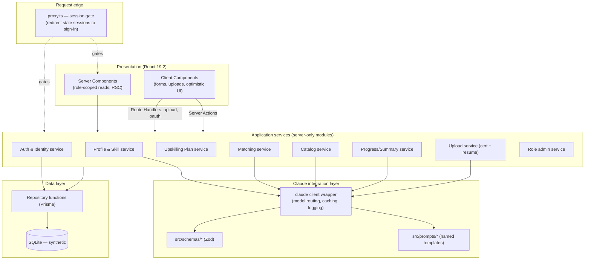
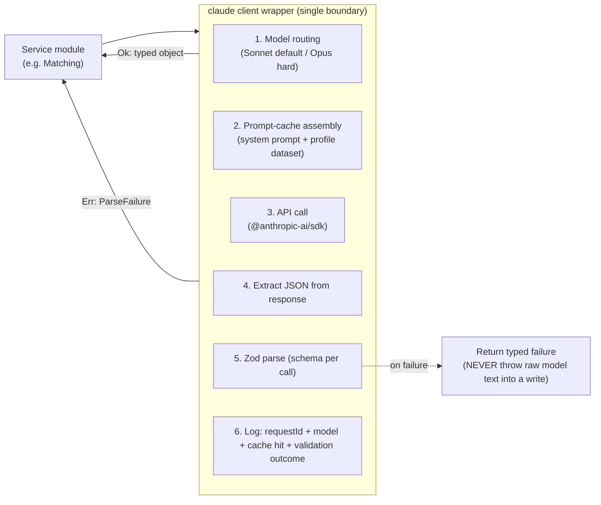
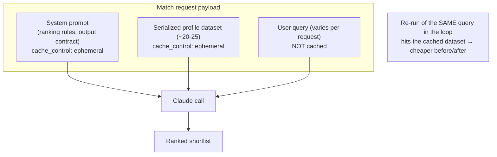
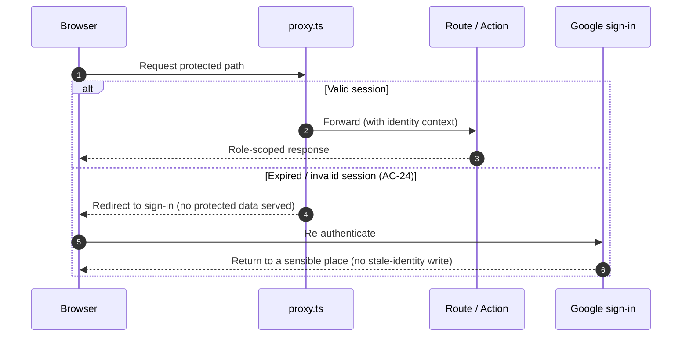
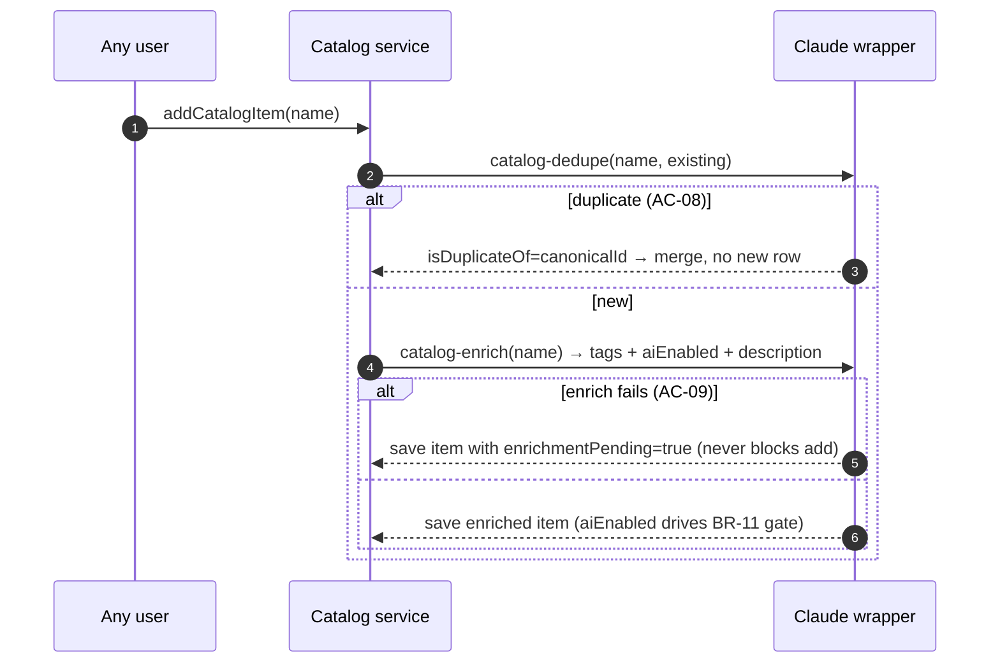
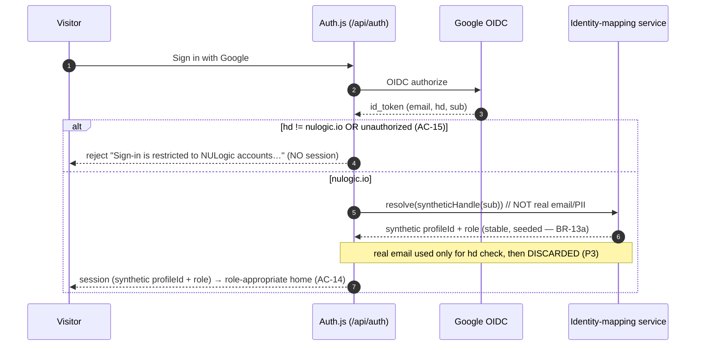

# Target State — Page 02: Service Design & API Contracts

**Initiative:** `skillsync-vertex-hackathon` · **Stage:** 03-architecture / target-state · **Version:** v1
**Mode:** TARGET-STATE · **Classification:** GREENFIELD · **Evidence:** `direct_scan`
**Branding:** NULogic. **Data:** Synthetic only — no real PII.
**Zero-code policy:** Mermaid + generic `text` pseudo-code only. No executable code or framework snippets.

> **What this page is.** The internal service decomposition of the single SkillSync app, the contracts for every Server Action and Route Handler, and the **Claude integration layer** — prompts in `src/prompts/`, Zod schemas, model routing (Sonnet default / Opus for hard ranking), and prompt caching of the profile dataset + system prompt. Every "smart" capability routes through one Claude call boundary; every write routes through one validated repository path.

> **Next.js 16 grounding (verified in `node_modules/next/dist/docs/`).** `middleware` is renamed to **`proxy.ts`**. **`cookies()` / `headers()` / `params` / `searchParams` are async-only.** Mutations are **Server Actions** (`use server`); file uploads + the OAuth callback are **Route Handlers** (`route.ts`); the session gate is **`proxy.ts`**. Turbopack is the default; Node 20.9+, React 19.2.

---

## 1. Architecture Style & Decomposition Rationale

SkillSync is **one Next.js application** — not a set of microservices. Per principle **P8 (demo-pragmatic)**, there is no separate API tier, message bus, or service mesh. Logical separation is achieved by **module boundaries inside the app**, not network boundaries.

**Why a single app (vs. split services):** the data volume is ~20–25 synthetic profiles, there is one data store, one consumer (the browser), and the hero loop must be trivially demoable end-to-end. Splitting into services would add deployment and integration risk against zero scaling benefit at this size. (See ADR-002 persistence and ADR-006 single-app in Page 05.)

### 1.1 Logical layers



### 1.2 Bounded contexts (single domain, internal modules)

There is **one bounded context** — *Employee Skill Profile* — owned by one data store. Internal modules carve responsibilities, not data ownership:

| Module (server-only) | Responsibility | Calls Claude? | Primary AC |
|---|---|---|---|
| **Auth & Identity** | Google OIDC, `nulogic.io` hosted-domain check, synthetic-handle→profile resolution, session lifecycle | No | AC-14, AC-15, AC-24 |
| **Profile & Skill** | Read role-scoped profiles; **upsert+promote** skill records (the BR-18 invariant); baseline + self-service skills | Yes (skill-identity de-dupe) | AC-16, AC-17, AC-22 |
| **Upload** | Cert + resume ingest, idempotency guard, parse orchestration, confirm-before-write | Yes (cert/resume parse) | AC-01..03, AC-19, AC-20, AC-23 |
| **Matching** | Plain-English query → availability-aware ranked shortlist | Yes (**Opus** for hard ranking) | AC-04, AC-05, AC-06, AC-21 |
| **Upskilling Plan** | Plan assembly + finalize-validation gate (≥2 items, ≥1 AI-enabled) | No (reuses catalog tag) | AC-26 |
| **Catalog** | Add-by-name → de-dupe / tag / enrich / recommend; manager `endorsed` toggle | Yes | AC-08, AC-09, AC-10, AC-27 |
| **Progress/Summary** | Role-scoped progress + compliance summarization | Yes | AC-12 |
| **Role Admin** | Admin-only assign/override role | No | AC-25 |

---

## 2. Claude Integration Layer (the architectural center of gravity — P1)

All intelligence routes through one client wrapper, one prompt directory, and one schema directory. This is where BR-09 (Claude-only), P2 (validate-before-write), P7 (token efficiency), and BR-12 (model routing + caching) are enforced architecturally.

### 2.1 Call-boundary anatomy



**Wrapper contract (pseudo-code):**
```text
function callClaude<T>(input):
    {promptName, variables, schema, complexity, cacheableContext} = input
    model = route(complexity)            // see §2.2
    messages = renderPrompt(promptName, variables)   // from src/prompts/
    system  = withCacheControl(systemPrompt, cacheableContext)  // see §2.3
    requestId = newId()
    response = anthropic.create({ model, system, messages })  // SDK call
    raw = extractStructuredBlock(response)   // tolerate prose around JSON
    result = schema.safeParse(raw)           // Zod — P2 gate
    log({ requestId, promptName, model, cacheHit: response.usage.cache_read, ok: result.success })
    if not result.success: return Failure(promptName, requestId)   // NEVER persist
    return Ok(result.data)
```
> **Guardrail:** if a real call is awkward to wire (e.g. file→base64 plumbing), the wrapper boundary is **stubbed with a `TODO`** that returns `Failure`, never fake parsed data (BR-09).

### 2.2 Model routing (BR-12 / P7)

| Capability | Default model | Rationale | When to escalate to Opus |
|---|---|---|---|
| Certificate parse | **Sonnet** | Structured extraction from a single doc | If multi-skill/unusual cert (AC-02) repeatedly underperforms |
| Resume parse | **Sonnet** | Structured extraction | Same as above |
| Catalog de-dupe / tag / enrich | **Sonnet** | Bounded normalization | — |
| Recommendations | **Sonnet** | Templated reasoning over one profile | — |
| Progress summary | **Sonnet** | Summarization over a scoped set | — |
| Skill-identity semantic de-dupe (is this "the same skill"?) | **Sonnet** | Short normalization decision | — |
| **Staffing match / ranking** | **Opus** | "Tricky ranking" — multi-candidate availability+skill reasoning, quality directly drives the hero loop (CLAUDE.md, BR-12) | Default here; downgrade to Sonnet only if cost/latency forces it and AC-04/AC-21 still pass |

Routing is a single function `route(complexity: "routine" | "hard") → modelId`; model ids are read from config/env, never hardcoded in business logic.

### 2.3 Prompt caching (P7 / BR-12)

The staffing matcher re-runs the **same profile dataset** across queries (and twice in the loop's before/after). Caching that dataset + the stable system prompt is the single biggest token saver.



**Caching rules:**
- Mark the **system prompt** and the **serialized profile dataset** as cacheable (cache breakpoint at the end of the dataset block).
- Keep the **per-request query** (and any per-request candidate filters) **outside** the cache breakpoint.
- The dataset serialization is **deterministic** (stable ordering) so cache keys are reused across the loop's before/after runs.
- Invalidate naturally: when a skill is promoted (loop), the dataset changes → new cache entry; the before-run and after-run differ by exactly the promoted record.

### 2.4 Prompt templates (`src/prompts/`) — named, never inlined

| Prompt template | Purpose | Output schema (Zod, §2.5) |
|---|---|---|
| `parse-certificate` | Cert image/PDF → skill extraction | `CertParseResult` |
| `parse-resume` | Resume → profile pre-population | `ResumeParseResult` |
| `match-staffing` | Query + dataset → ranked shortlist | `MatchResult` |
| `catalog-dedupe` | New item vs existing → canonical decision | `DedupeDecision` |
| `catalog-enrich` | Name → tags + enrichment (incl. `aiEnabled`) | `CatalogEnrichment` |
| `recommend-items` | Profile + gaps → recommended items | `Recommendations` |
| `summarize-progress` | Scoped cohort → on-track/behind/thin coverage | `ProgressSummary` |
| `skill-identity` | "Is skill A the same as skill B?" (BR-18 de-dupe) | `SkillIdentityDecision` |

Each template is a named export returning the message array given typed variables. Long instructions live in the template, **never** inline in service code (P7).

### 2.5 Zod schemas (`src/schemas/`) — the write gate (P2)

Representative shapes (pseudo-schema — generic types):

```text
CertParseResult {
  skills: [{ skill: string, level?: string }]   // ≥1; multi-skill allowed (AC-02)
  issuer: string
  date?: string
  confidence: number   // 0..1 — gate below threshold ⇒ treat as failure (AC-03)
}

ResumeParseResult {
  currentProject?: string
  allocation?: int (0..100)
  baselineSkills: [{ skill: string, level?: string }]   // may be empty
  confidence: number
}

MatchResult {
  requested?: { count?: int, summary: string }
  results: [{
    profileId: string,
    matchPercent: number (0..100),
    matchedSkills: string[],
    gaps: string[],
    availability: string,        // e.g. "free now", "free in ~2 weeks"
    rationale: string            // one line
  }]
  shortfallNote?: string         // e.g. "2 of 3 requested qualify" (AC-21)
}

DedupeDecision {
  isDuplicateOf?: string         // existing canonical CatalogItem id, or null
  canonicalName: string
}

CatalogEnrichment {
  tags: { skillArea: string, level?: string, roleRelevance: string[] }
  aiEnabled: boolean             // drives BR-11 plan gate (AC-26)
  description?: string, provider?: string, typicalDuration?: string, prerequisites?: string[]
}

SkillIdentityDecision { sameAs?: string /* canonical skill id */, canonicalName: string }
```

**Gate behavior (every Claude-driven write):** `safeParse` fail OR `confidence < threshold` ⇒ return failure, write nothing, surface the spec'd user message. This single rule satisfies AC-03, AC-06, AC-20 and NFR "no garbage on parse failure".

### 2.6 Observability at the call boundary (NFR Observability)
Each call logs `requestId`, `promptName`, `model`, `cacheRead/cacheWrite` token counts, and `validationOutcome`. This is the diagnostic surface for parse/match failures during the demo. No PII is logged (P3) — only synthetic profile ids and skill names.

---

## 3. API Surface — Server Actions & Route Handlers

**Convention (Next.js 16, P9):** mutations are **Server Actions**; file uploads and the OAuth callback are **Route Handlers**; reads are RSC data functions. `cookies()`/`headers()` are awaited. The session gate is `proxy.ts`.

### 3.1 Server Actions (mutations)

| Action | Module | Auth scope | Input → Output | Key rules |
|---|---|---|---|---|
| `addOrUpdateSelfSkill` | Profile&Skill | Own profile only | `{skillName, level}` → `{skill}` or inline error | Writes `source=self-reported, state=self-reported`; rejects blank (AC-17); routes through upsert+promote (BR-18) |
| `approveSkill` | Profile&Skill | Manager/HR over the employee | `{employeeId, skillRecordId}` → `{newState}` | Authority check (BR-15/BR-03); promote `self-reported→manager-approved` on the same record (AC-18) |
| `finalizePlan` | Upskilling Plan | Own plan | `{itemIds[]}` → `{accepted}` or `{rejected, reason}` | ≥2 items AND ≥1 `aiEnabled` (AC-26); specific message per failed rule; remove/swap re-validates |
| `addCatalogItem` | Catalog | Any authenticated | `{name}` → `{item}` | Claude de-dupe→merge or create; enrich; on enrich-fail set `enrichmentPending` (AC-08/09) |
| `setEndorsed` | Catalog | Manager/HR/Admin only | `{itemId, endorsed:boolean}` → `{item}` | Authority-gated set/unset (AC-27); non-manager denied |
| `assignRole` | Role Admin | Admin only | `{userId, role}` → `{user}` | Only Admin management capability (AC-25/BR-21); re-scopes target's access |
| `confirmCertExtraction` | Upload | Own profile | `{uploadId, confirmedSkills[]}` → `{promotedSkills[]}` | Persists only after user confirm; upsert+promote to `verified` (AC-01/22) |
| `confirmResumeExtraction` | Upload | Own profile | `{uploadId, confirmedFields}` → `{profile}` | Pre-populate; baseline skills `self-reported` (AC-19); idempotent (AC-23) |

> **`runMatch` is NOT in this table — a staffing search is a READ, not a mutation (TS-003).** It is specified as a **read-only Route Handler** in §3.2a, not a Server Action. See that section for transport, caching, and rationale.

> **Server Action discipline:** every action **re-derives the session and role server-side** (never trusts a client-sent role), awaits `cookies()`, and on a stale session returns a redirect-to-sign-in (composed with `proxy.ts`, AC-24).

### 3.2 Route Handlers (`route.ts`)

| Handler | Method | Purpose | Notes |
|---|---|---|---|
| `/api/auth/[...]` (Auth.js handler) | GET/POST | Google OIDC sign-in + callback | Library-owned routes (ADR-001); `hd` check in callback (AC-14/15) |
| `/api/uploads/certificate` | POST (multipart) | Receive cert file → orchestrate parse | Idempotency guard (content hash, BR-19); returns `{uploadId, extracted}` for confirm step |
| `/api/uploads/resume` | POST (multipart) | Receive resume file → orchestrate parse | Same idempotency guard; returns `{uploadId, extracted}` |

> File uploads are Route Handlers (not Server Actions) so multipart streaming + size limits are handled at the request edge; the parse → Zod → **confirm** → persist split keeps "never write garbage on failure" (P2) and idempotency (BR-19) explicit.

### 3.2a `runMatch` — read transport (NOT a mutation) (TS-003)

A staffing search **reads** the profile dataset and returns a ranked shortlist; it **writes nothing**. It is therefore specified as a **read-oriented Route Handler**, not a Server Action, resolving the earlier "may be an action or a handler" ambiguity.

| Handler | Method | Module | Auth scope | Input → Output | Key rules |
|---|---|---|---|---|---|
| `/api/match` | **POST** (read-only; query in body) | Matching | Manager/HR/PL (PL=team); Employee denied | `{queryText}` → `MatchResult` | Opus ranking; cached dataset; **no DB writes**; graceful failure (AC-04/06/21) |

**Why POST-as-read, not GET, and not a Server Action:**
- **Not a Server Action** — Server Actions are the mutation convention (they post to the page, integrate with form/optimistic-UI revalidation, and signal *write* intent). `runMatch` mutates nothing, so modeling it as a mutation is semantically wrong and muddies caching/idempotency reasoning (the finding). A read-oriented handler keeps reads and writes cleanly separated (P9).
- **POST over GET** — the free-text `queryText` (and any candidate filters) can be long and is more naturally carried in a request body than a URL; the call is **safe and idempotent** regardless (re-running the same query returns the same ranking and changes no state), so it satisfies read semantics without abusing GET length limits. A GET variant with the query in the querystring is an acceptable equivalent; the binding decision is **read-only handler, not mutation**.
- **Caching** — the handler builds the role-scoped dataset deterministically and calls Claude with the **cached system prompt + serialized dataset** (§2.3). Because it is a pure read, the loop's before/after re-run is just two reads over a dataset that changed by exactly one promoted record — no mutation/idempotency concerns on the search itself.
- **Auth scope** — the handler re-derives session + role server-side (same discipline as actions); Employees are denied (BR-03/AC-11), PL is scoped to their team.

> The Matching service module (§4.2) is unchanged; only the **transport** is pinned: a read-only handler, never a mutation.

### 3.3 Session gate — `proxy.ts` (P6/P9 — was "middleware" pre-Next-16)


`proxy.ts` matches protected paths (excluding `/api/auth`, static, sign-in). Minimal scope per `scope-boundary.v1.md`: no token-refresh/remember-me — just gate + graceful redirect.

---

## 4. Per-Capability Designs (per-REQ flows)

### 4.1 Certificate parsing → verified skill (UC-1 · AC-01/02/03/22/23)

```mermaid
sequenceDiagram
    autonumber
    participant EMP as Employee
    participant RH as /api/uploads/certificate
    participant IDEM as Idempotency guard
    participant AISVC as Claude wrapper
    participant Z as Zod (CertParseResult)
    participant SA as confirmCertExtraction
    participant REPO as Skill upsert+promote
    EMP->>RH: POST cert file (multipart)
    RH->>IDEM: hash(file)+employee → seen before?
    alt duplicate (AC-23)
        IDEM-->>RH: return prior uploadId (no re-parse)
    else new
        RH->>AISVC: parse-certificate(file) [Sonnet]
        AISVC->>Z: safeParse(model output)
        alt invalid OR confidence<threshold (AC-03)
            Z-->>RH: failure → "couldn't reliably read…"; item stays in-progress; NO write
        else valid
            Z-->>RH: CertParseResult
            RH-->>EMP: show extracted skills to confirm
            EMP->>SA: confirmCertExtraction(uploadId, skills)
            SA->>REPO: resolveCanonicalSkill → UPSERT (profileId, canonicalSkillId) → PROMOTE to verified
            Note over SA,REPO: Layer 1 deterministic canonicalKey resolves the row;<br/>Claude skill-identity (Layer 2) only advises merges
            alt skill-identity de-dupe fails/unreachable (TS-002)
                Note over REPO: FALLBACK — persist via deterministic canonicalKey,<br/>create-new + reconcilePending; write NEVER blocked/corrupted
            end
            Note over REPO: same record promoted, never a duplicate (BR-18/AC-22)
            REPO-->>EMP: item=done; profile carries verified skill
        end
    end
```

> **De-dupe failure must not break the P0 write (TS-002).** The skill-identity Claude call is a **merge *advisor*, not a gate** on this most-protected step. `confirmCertExtraction` resolves the persistence key via the **deterministic `canonicalKey`** (Page 03 §3.4 Layer 1) — which never depends on a model call — and only consults Claude `skill-identity` (Layer 2) to merge harder semantic aliases. If that call fails, times out, or returns invalid JSON, the write **falls back to create-new keyed by `canonicalKey` with a `reconcilePending` flag** and the cert still promotes to `verified`. Consequences: the verified write always completes (no hang, no error after a successful parse+confirm), the row is never corrupted, and the only downside is a possibly-redundant Skill row resolved by a later reconcile pass — degraded de-dupe quality, never broken loop correctness. The `@unique` `canonicalKey` (Page 03 §4.2) keeps the fallback create-new single-record even under concurrency.

### 4.2 Availability-aware staffing match (UC-2 · AC-04/05/06/21)

```mermaid
sequenceDiagram
    autonumber
    participant MGR as Manager/PL
    participant SVC as Matching service
    participant DS as Dataset builder (role-scoped)
    participant AISVC as Claude wrapper (Opus, cached)
    participant Z as Zod (MatchResult)
    MGR->>SVC: queryText ("3 mid React+Node, free ≤2wks, IST")
    SVC->>DS: build dataset (scope: PL=team / Mgr=org)
    DS-->>SVC: deterministic serialized profiles (allocation, freeFrom, skills+state)
    SVC->>AISVC: match-staffing(query, dataset) [Opus; dataset cached]
    AISVC->>Z: safeParse
    alt invalid/unreachable (AC-06)
        Z-->>MGR: "Search is temporarily unavailable — please retry." (no partial ranking)
    else valid
        Z-->>SVC: MatchResult (matchPercent, matched, gaps, availability, rationale)
        alt fewer than requested qualify (AC-21)
            SVC-->>MGR: results + shortfallNote "2 of 3 requested qualify"
        else no perfect fit (AC-05)
            SVC-->>MGR: closest people + gap/ramp-up notes (never empty)
        else happy
            SVC-->>MGR: ranked shortlist
        end
    end
```
**Availability reasoning is part of the Claude call** (BR-04): the prompt instructs ranking over `allocation` + `freeFrom` ("free now" vs "free in ~2 weeks"), not skill overlap alone. No keyword/date arithmetic substitute (BR-09).

### 4.3 The loop (hero · UC-3 · AC-07/22/23)

```mermaid
sequenceDiagram
    autonumber
    participant MGR as Manager
    participant MATCH as Matching
    participant EMP as Employee
    participant UP as Upload+confirm
    participant REPO as Skill record
    MGR->>MATCH: run query → candidate X has gap "AWS"
    MATCH->>EMP: (via recommend-items) suggest catalog item for AWS gap
    EMP->>UP: upload AWS cert → parse → confirm
    UP->>REPO: UPSERT (X, AWS) → promote self-reported/approved → VERIFIED
    Note over REPO: SAME record promoted (BR-18); idempotent (BR-19)
    MGR->>MATCH: re-run the SAME query (cached dataset, now changed for X)
    MATCH-->>MGR: X's matchPercent/rank visibly improves (weight from verified state)
```
The before/after delta is **driven by the promoted trust state** of the single record. A failed comparison signature = a duplicated skill row; P4 + idempotency prevent it.

### 4.4 Resume upload + extraction (UC-9 · AC-19/20/23)
Mirrors §4.1 but via `/api/uploads/resume` → `parse-resume` (Sonnet) → `ResumeParseResult` → **confirm** → pre-populate profile; baseline skills written `source=self-reported` (resume is self-attested). Parse failure ⇒ write nothing, spec'd message (AC-20). Double-submit ⇒ idempotent (AC-23).

### 4.5 Catalog intelligence (UC-5 · AC-08/09/10/27)

**Endorsed flag (AC-27):** `setEndorsed` is authority-gated to Manager/HR/Admin; endorsed items are surfaced in catalog + recommendation views. Flag only — no workflow (BR-22).

### 4.6 Manager approval (UC-8 · AC-18) & Plan validation (UC-1 · AC-26)
- **Approval:** `approveSkill` checks the actor has authority over the employee (Manager/HR org-wide; PL only own team), then promotes the **same** record `self-reported→manager-approved` (BR-15/18). Unauthorized ⇒ denied (AC-18).
- **Plan finalize:** `finalizePlan` counts items and checks ≥1 has `aiEnabled=true` (from catalog tag). `<2` ⇒ *"Pick at least 2 items for your plan."*; `0 AI-enabled` ⇒ *"Your plan needs at least one AI-enabled item."* Conforming ⇒ marked complete, counts toward §8 compliance (AC-26). This is a **constraint, not new intelligence** (reuses the Claude-assigned `aiEnabled` tag).

### 4.7 Auth + deterministic identity mapping (UC-6/6b · AC-14/15/24)

The mapping is keyed by a **synthetic handle** (e.g. a hash/opaque key derived from the OIDC `sub`), seeded so the same identity always resolves to the same synthetic profile — making AC-14 deterministically testable with **no real PII** persisted.

---

## 5. Cross-Cutting Concerns

| Concern | Approach | Trace |
|---|---|---|
| **Authorization** | Role + ownership re-derived server-side in every action/read; PL scoped to team; Employee blocked from matcher | BR-03, AC-11, AC-18, AC-25 |
| **Validation** | Zod `safeParse` at every Claude boundary AND for user input (blank-skill reject) | P2, AC-03/17/20 |
| **Idempotency** | **DB-enforced** `@@unique([employeeId, contentHash])` on Certificate/Resume (app-layer guard is the fast path, the constraint is the race-safe backstop) + `(profileId, canonicalSkillId)` skill upsert | BR-19, AC-23, TS-004 |
| **Claude de-dupe resilience** | skill-identity is a merge *advisor*, not a write gate; on failure fall back to deterministic `canonicalKey` create-new + reconcile-later — the P0 cert-confirm write never blocks/corrupts | TS-002, AC-22 |
| **Error UX** | Each Claude flow returns a typed failure → spec'd user message; never a crash | NFR Resilience, §10 PRD table |
| **Secrets** | `ANTHROPIC_API_KEY`, Google client id/secret, auth secret from env; `.env.example` placeholders only | P3, AC-13 |
| **No-PII** | Synthetic-handle mapping; discard real email; logs carry only synthetic ids | P3, AC-13/14 |
| **Token efficiency** | Sonnet default / Opus for match; cache system prompt + dataset | P7, BR-12 |

---

## 6. Systems Impacted (build estimate — T-shirt; full roadmap in Page 04)

| Internal module / artifact | Net-new or extend | T-shirt | Gap id (current-state) |
|---|---|---|---|
| Claude client wrapper + `src/prompts/` + `src/schemas/` | Net-new | **M** | TD-AI-01/02 |
| Upload service (cert+resume, idempotency) | Net-new | **L** | TD-CERT-01, TD-RESUME-01, TD-DATA-05 |
| Matching service (Opus, cached dataset) | Net-new | **L** | TD-MATCH-01 |
| Profile&Skill upsert+promote | Net-new (extends `EmployeeSkill`) | **M** | TD-DATA-01, TD-PROFILE-01 |
| Auth & Identity (Auth.js + hd + mapping) | Net-new | **L** | TD-AUTH-01/02/03 |
| `proxy.ts` session gate | Net-new | **S** | TD-AUTH-03 |
| Catalog service + endorsed | Net-new (extends `CatalogItem`) | **L** | TD-CAT-01, TD-DATA-03 |
| Plan service + finalize gate | Net-new | **M** | TD-PLAN-01 |
| Progress/Summary | Net-new | **M** | TD-PROG-01 |
| Role admin | Net-new | **S** | TD-ADMIN-01 |

---

## 7. Cross-References
- **Page 01** — system overview, principles P1–P9, the loop.
- **Page 03** — Prisma schema backing every contract here: the `Skill.canonicalKey @unique` + `EmployeeSkill @@unique` pair (BR-18 single-record, TS-001), the canonical-resolution + de-dupe-failure fallback (§3.4, TS-002), the `@@unique([employeeId, contentHash])` upload idempotency (TS-004), catalog flags, plan, resume, identity-mapping table.
- **Page 04** — phasing, per-AC traceability, risks.
- **Page 05** — ADRs: auth library (ADR-001), persistence (ADR-002), Claude call patterns + validation + caching (ADR-003), file/upload handling (ADR-004), synthetic-data (ADR-005), single-app shape (ADR-006).
