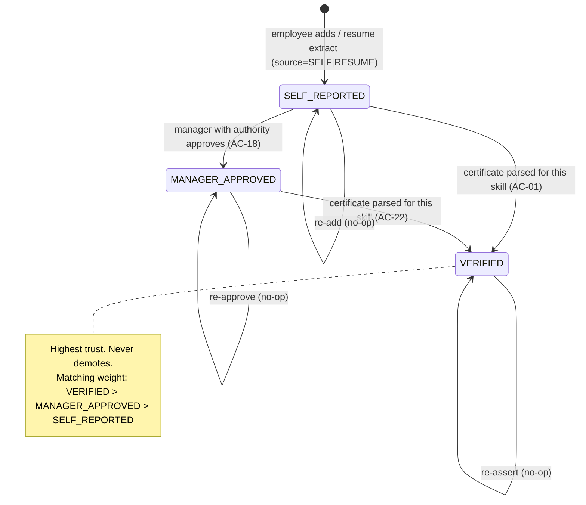
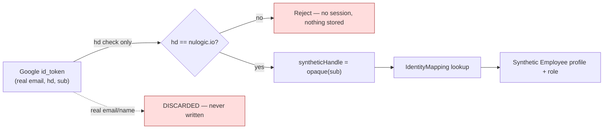

# Target State — Page 03: Data Model

**Initiative:** `skillsync-vertex-hackathon` · **Stage:** 03-architecture / target-state · **Version:** v1
**Mode:** TARGET-STATE · **Classification:** GREENFIELD · **Evidence:** `direct_scan`
**Branding:** NULogic. **Data:** Synthetic only — no real PII in repo, DB, or fixtures.
**Zero-code policy:** Mermaid + generic pseudo-schema only. The Prisma DSL fragments below are **schema design intent**, not final code.

> **What this page is.** The target Prisma/SQLite data model. It **extends the existing starter schema** (`prisma/schema.prisma`, verified this run) rather than replacing it, and adds exactly what the PRD/business-rules require: the **skill trust-state machine on a single promotable record**, **catalog `aiEnabled`/`endorsed`/enrichment** signals, the **UpskillingPlan**, the **Resume** model, **upload idempotency**, profile fields for matching, and the **OAuth-identity→synthetic-profile mapping table (no real PII)**.

> **SQLite constraint (verified in starter, line 2).** SQLite has no native enums; role/state/status/source are stored as **Strings with documented value sets**. This is intentional and demo-pragmatic (P8); promotion ordering is enforced in the repository layer, not the DB.

---

## 1. Starter Schema — What Exists Today (verified)

From `prisma/schema.prisma` (read this run): generator outputs the client to `../lib/generated/prisma`; datasource is `sqlite`. Six models exist: `Employee`, `Skill`, `EmployeeSkill`, `CatalogItem`, `Enrollment`, `Certificate`.

| Starter model | Keep | Extend | Gap (current-state) |
|---|---|---|---|
| `Employee` | ✓ | + `timezone`, `seniority`, identity relation | TD-DATA-04 |
| `Skill` | ✓ | + `canonicalKey` for semantic de-dupe | TD-DATA-01 |
| `EmployeeSkill` | ✓ | **+ `trustState`, `origin` (baseline vs acquired)** — the core change | TD-DATA-01 |
| `CatalogItem` | ✓ | **+ `aiEnabled`, `endorsed`, `enrichmentPending`, typed enrichment fields** | TD-DATA-03 |
| `Enrollment` | ✓ | role in plan (link to `UpskillingPlan`) | TD-PLAN-01 |
| `Certificate` | ✓ | **+ `contentHash` (idempotency)** | TD-DATA-05 |
| — | — | **New:** `Resume`, `UpskillingPlan`, `PlanItem`, `IdentityMapping` | TD-DATA-02, TD-AUTH-02 |

**Preserved invariants from the starter:** `Skill.name @unique`, `EmployeeSkill @@unique([employeeId, skillId])` (this *is* the BR-18 single-record key), `Enrollment @@unique([employeeId, catalogItemId])`, Practice-Lead self-relation (`leadId`/`team`).

---

## 2. Target Entity-Relationship Model

```mermaid
erDiagram
    Employee ||--o{ EmployeeSkill : has
    Employee ||--o{ Enrollment : tracks
    Employee ||--o{ Certificate : uploads
    Employee ||--o{ Resume : uploads
    Employee ||--o| UpskillingPlan : owns
    Employee ||--o{ Employee : "leads (team)"
    Employee ||--o| IdentityMapping : "resolved by"
    Skill ||--o{ EmployeeSkill : "instance of"
    CatalogItem ||--o{ Enrollment : "enrolled via"
    CatalogItem ||--o{ PlanItem : "chosen in"
    UpskillingPlan ||--o{ PlanItem : contains

    Employee {
        string id PK
        string name "synthetic only"
        string email UK "synthetic only"
        string role "ADMIN|MANAGER|PRACTICE_LEAD|EMPLOYEE"
        string title
        string practice
        string seniority "NEW: JUNIOR|MID|SENIOR"
        string timezone "NEW: e.g. IST (AC-04)"
        int allocation "0-100"
        datetime freeFrom
        string leadId FK
    }
    Skill {
        string id PK
        string name UK
        string canonicalKey "NEW: normalized de-dupe key"
        string category "Claude-assigned"
    }
    EmployeeSkill {
        string id PK
        string employeeId FK
        string skillId FK
        int proficiency "1-5"
        string trustState "NEW: SELF_REPORTED|MANAGER_APPROVED|VERIFIED"
        string origin "NEW: BASELINE|ACQUIRED"
        string source "SELF|CERTIFICATE|RESUME|CATALOG"
        datetime promotedAt "NEW"
    }
    CatalogItem {
        string id PK
        string name
        string provider
        string kind "CERT|COURSE"
        boolean aiEnabled "NEW: BR-11 gate"
        boolean endorsed "NEW: BR-22"
        boolean enrichmentPending "NEW: BR-07"
        string description "NEW"
        string typicalDuration "NEW"
        string tagsJson "skillArea/level/roleRelevance"
    }
    UpskillingPlan {
        string id PK
        string employeeId FK UK
        string status "DRAFT|FINALIZED"
        datetime finalizedAt
    }
    PlanItem {
        string id PK
        string planId FK
        string catalogItemId FK
    }
    Certificate {
        string id PK
        string employeeId FK
        string fileName
        string contentHash "NEW: idempotency (BR-19)"
        string rawText
        string parsedJson "Zod-validated extraction"
        datetime uploadedAt
    }
    Resume {
        string id PK
        string employeeId FK
        string fileName
        string contentHash "NEW: idempotency"
        string parsedJson "Zod-validated extraction"
        datetime uploadedAt
    }
    IdentityMapping {
        string id PK
        string syntheticHandle UK "NOT real email/PII (BR-13a)"
        string employeeId FK
    }
```

---

## 3. The Skill Trust-State Machine (BR-18 — the core design)

This is the single most important data decision. A skill on a profile is **one row** (`EmployeeSkill`) whose `trustState` field **monotonically promotes** and **never duplicates**.

### 3.1 State machine



**Ordering (enforced in repository layer, not DB):** `SELF_REPORTED(1) < MANAGER_APPROVED(2) < VERIFIED(3)`.

### 3.2 The upsert+promote write path (the one path all skill writes use)

```text
function upsertAndPromoteSkill(profileId, skillNameOrId, targetState, source, origin):
    canonicalSkillId = resolveCanonicalSkill(skillNameOrId)   // Claude skill-identity de-dupe (BR-18), NOT string-equality
    existing = find EmployeeSkill by (profileId, canonicalSkillId)   // the @@unique key
    if existing is null:
        insert EmployeeSkill(profileId, canonicalSkillId, trustState=targetState, source, origin)
    else:
        if order(targetState) > order(existing.trustState):
            update existing.trustState = targetState   // PROMOTE same row; set promotedAt
        else:
            no-op   // equal-or-lower never demotes (AC-22)
    return the single canonical record
```

**Why this satisfies the AC:**
- **AC-22** — re-asserting at equal/lower trust is a no-op; higher trust promotes the same row; never a duplicate.
- **AC-07 (hero)** — the loop's before/after compares this same row; cert upload promotes `→ VERIFIED`, raising matching weight.
- **AC-17/18/01** — self-service add, manager approval, and cert verify are all the same call with different `targetState`.
- Identity resolution (`resolveCanonicalSkill`) is a **Claude call** (BR-18/BR-06 discipline) so "TypeScript" self-reported and a "TypeScript" certificate converge to one record — no regex.

### 3.3 Baseline vs acquired (BR-16 / AC-16)
`origin` distinguishes `BASELINE` (skills held before upskilling; seeded or self-reported/resume-derived) from `ACQUIRED` (gained via the tracker/cert). This lets the profile and the demo show capability growth, and lets matching reason over baseline skills + availability (AC-16, P0).

---

## 4. Model-by-Model Design Notes

### 4.1 Employee (extend)
Adds `seniority` (`JUNIOR|MID|SENIOR` — needed for "mid-level" queries, AC-04) and `timezone` (IST-overlap, AC-04). `allocation` + `freeFrom` already present (starter lines 24–25) and feed availability reasoning (BR-04). `role` already present; data scoping enforced in the app layer (BR-03). **Synthetic `name`/`email` only** (starter comments preserved).

### 4.2 Skill (extend)
Adds `canonicalKey` — a normalized key produced by the Claude skill-identity decision and used to find/merge canonical skills. `name @unique` retained. Category is Claude-assigned.

### 4.3 EmployeeSkill (extend — the core change)
Replaces the flat `source` string semantics with the **trust-state machine**: adds `trustState`, `origin`, `promotedAt`; keeps `source` (provenance), `proficiency`, and crucially the **`@@unique([employeeId, skillId])`** which is the BR-18 single-record key. No new "history" table — promotion mutates the row (P8; approval workflow sprawl is out of scope).

### 4.4 CatalogItem (extend — BR-07/11/22)
Adds typed `aiEnabled` (drives the plan gate AC-26 — must be a reliable boolean, not parsed from `tags`), `endorsed` (BR-22/AC-27), `enrichmentPending` (BR-07/AC-09 graceful degradation), and enrichment fields (`description`, `typicalDuration`, `provider`). `tagsJson` retains the richer Claude tags (skillArea/level/roleRelevance). De-dupe merges into the canonical row (AC-08) — no duplicate items.

### 4.5 UpskillingPlan + PlanItem (new — BR-11/AC-26)
A plan is one-per-employee (`@@unique` on `employeeId`) with `status DRAFT|FINALIZED`. `PlanItem` links chosen `CatalogItem`s. **Finalize validation** (≥2 items AND ≥1 with `aiEnabled=true`) runs in the Plan service (Page 02 §4.6); non-conforming ⇒ stays `DRAFT`, specific message; conforming ⇒ `FINALIZED`, counts toward §8 compliance. The starter `Enrollment` (progress: NOT_STARTED/IN_PROGRESS/COMPLETED) is retained for per-item progress tracking and links to the plan.

### 4.6 Certificate (extend) + Resume (new) — BR-17/19
Both store `fileName`, `contentHash` (idempotency — same file → same hash → no re-parse, AC-23), and `parsedJson` (the Zod-validated extraction kept for audit/demo). `Resume.parsedJson` holds `{currentProject, allocation, baselineSkills[]}`. Neither stores PII beyond synthetic profile linkage; uploaded files live in demo-local storage only (ADR-004).

### 4.7 IdentityMapping (new — BR-13a / AC-14)
The **OAuth-identity→synthetic-profile** table. Keyed by `syntheticHandle @unique` (an opaque key derived from the OIDC `sub`, **never** the real email/PII), mapping to an `Employee` (synthetic profile + role). Seeded so resolution is **deterministic and testable**. The real email is used only transiently for the `nulogic.io` hosted-domain check and **discarded** (P3). This table is the only thing that touches authentication, and it contains **zero real PII**.

---

## 5. No-PII Guarantee by Design (BR-10 / AC-13 / P3)



| Data | Stored? | Where |
|---|---|---|
| Real email / name from Google | **No** | discarded after hd check |
| OIDC `sub` (raw) | **No** (only its opaque derivative) | — |
| `syntheticHandle` (opaque) | Yes | `IdentityMapping` |
| Synthetic profile (name/email/skills) | Yes | `Employee` + related (seeded synthetic) |

**Review gate:** seed data and fixtures are inspected for PII before any commit (AC-13). All `Employee.name`/`email` are synthetic.

---

## 6. Persistence, Migrations & Seed

- **Engine:** SQLite via Prisma (`dev.db` present). Single-file DB, zero infra — correct for a hackathon (ADR-002, P8).
- **Schema application:** `db:push` is wired (`package.json:15`). Migration history is **deferred** (TD-DATA-06, Low) — acceptable for MVP; `prisma.config.ts` already declares `migrations.path`.
- **Generated client:** `lib/generated/prisma` (starter generator output) — consumed by the repository layer.
- **Seed (TD-SEED-01):** the `seed` script (currently a `TODO` stub) generates **~20–25 synthetic profiles** with baseline skills (`origin=BASELINE`), allocation + `freeFrom`, seniority, timezone; a starter catalog (with `aiEnabled` set); and the **seeded `IdentityMapping`** entries (synthetic handles) that make AC-14 deterministic.
- **Fixtures (TD-SEED-02):** synthetic `fixtures/certs/` and `fixtures/resumes/` for parse tests and the demo.

### 6.1 Indexing & integrity (demo-appropriate)
| Constraint | Purpose | AC |
|---|---|---|
| `EmployeeSkill @@unique([employeeId, skillId])` | The BR-18 single-record key | AC-22 |
| `Certificate.contentHash` / `Resume.contentHash` (+ employee) | Idempotent uploads | AC-23 |
| `UpskillingPlan @@unique([employeeId])` | One plan per employee | AC-26 |
| `IdentityMapping.syntheticHandle @unique` | Deterministic identity resolution | AC-14 |
| `Skill.name @unique` + `canonicalKey` | Canonical skill identity | AC-22 |
| FK cascades (starter) | Clean deletes for synthetic data | — |

---

## 7. Data Volume & Lifecycle (demo scope)
~20–25 profiles, a few dozen catalog items, a handful of certs/resumes per demo. No partitioning, sharding, archival, or CDC — explicitly out of scope (`scope-boundary.v1.md`). The DB is disposable and re-seedable; the loop's state change (one promoted skill) is the only mutation that matters for the demo narrative.

---

## 8. Cross-References
- **Page 01** — principles P3 (no PII), P4 (single record).
- **Page 02** — the upsert+promote repository function and the Claude `skill-identity` call that backs §3.2; the IdentityMapping resolution flow.
- **Page 04** — schema work is Phase 1 (Foundation); seed + fixtures gate everything.
- **Page 05** — ADR-002 (persistence), ADR-005 (synthetic data), ADR-001 (auth/identity mapping).
