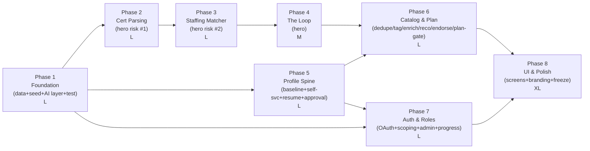
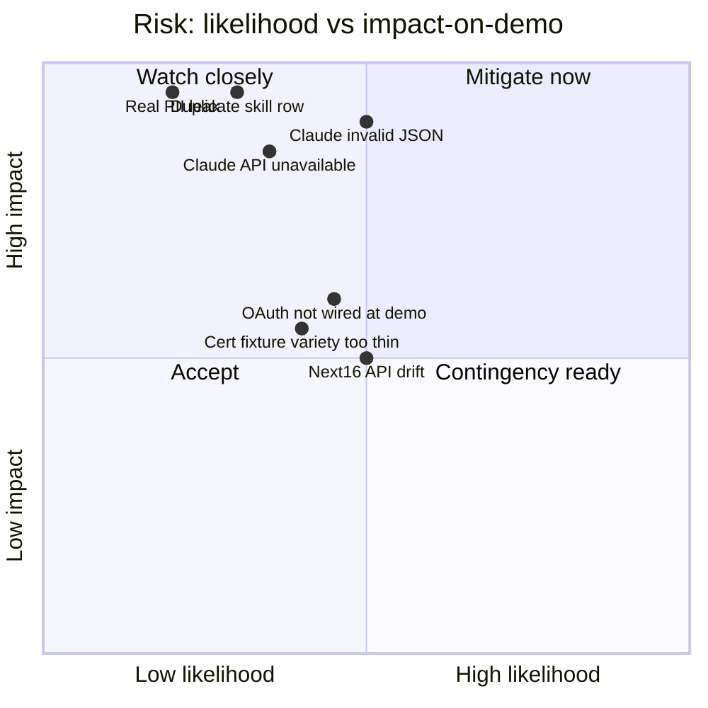

# Target State — Page 04: Implementation Roadmap

**Initiative:** `skillsync-vertex-hackathon` · **Stage:** 03-architecture / target-state · **Version:** v1
**Mode:** TARGET-STATE · **Classification:** GREENFIELD · **Evidence:** `direct_scan`
**Branding:** NULogic. **Data:** Synthetic only — no real PII.
**Sizing:** Agile T-shirt (XS/S/M/L/XL). **No calendar dates** — sequencing only.

> **What this page is.** A phased delivery plan that **protects the hero loop above all** and follows the de-risked `CLAUDE.md` build order: synthetic data + profiles → cert parsing → matcher → the loop → catalog → auth/roles → UI. Phases are cohesive, mostly independently shippable chunks sized so Stage 4 story-splitting is natural (**8 phases**). Each phase maps to PRD acceptance criteria and current-state gap ids.

> **Sequencing rationale:** **risk-first**. The riskiest, loop-critical work (intelligence layer → cert parse → matcher → loop) goes first on a foundation of synthetic data + the trust-state schema. Auth and UI — important but lower loop-risk and with a view-switcher fallback — come later. Freeze ~Day 6–7, then polish.

---

## 1. Phase Overview

**Critical path (must not slip):** P1 → P2 → P3 → P4. Everything else hangs off the foundation and the loop.

---

## 2. Phase Details

### Phase 1 — Foundation (size **L**) · critical path
**Goal:** the substrate every later phase needs — synthetic data, the trust-state schema, the Claude call boundary, the test harness, the no-PII guardrail.
**Deliverables:**
- Extend Prisma schema per Page 03 (trust-state `EmployeeSkill`, catalog flags, `UpskillingPlan`/`PlanItem`, `Resume`, `Certificate.contentHash`, `IdentityMapping`, Employee `seniority`/`timezone`). Apply via `db:push`.
- Synthetic seed: ~20–25 profiles (baseline skills, allocation, `freeFrom`, seniority, timezone), starter catalog with `aiEnabled`, seeded `IdentityMapping`.
- Fixtures: `fixtures/certs/`, `fixtures/resumes/` (synthetic).
- Claude integration layer skeleton: client wrapper (model routing, prompt caching, logging), `src/prompts/` template scaffolding, `src/schemas/` Zod skeletons.
- Test config (`vitest.config`) + single-file test command; no-PII review gate.
**Exit criteria:** seed runs clean; schema matches Page 03; a stubbed Claude call validates through Zod; tests run; zero PII in seed/fixtures.
**AC:** AC-13, AC-16 (data present) · **Gaps:** TD-SEED-01/02, TD-DATA-01..05, TD-AI-01/02, TD-TEST-01, TD-GUARD-01, TD-DOC-01.

### Phase 2 — Certificate Parsing (size **L**) · critical path · **hero risk #1**
**Goal:** the riskiest, highest-value capability — upload → Claude → Zod → confirm → promote to `verified`.
**Deliverables:** `/api/uploads/certificate` (multipart + idempotency hash); `parse-certificate` prompt (Sonnet) + `CertParseResult` schema; confidence gate; `confirmCertExtraction` action; upsert+promote write path (BR-18); cert-parse tests against `fixtures/certs/`.
**Exit criteria:** majority of fixtures parse to valid Zod JSON (§8 metric); low-confidence/failed parse writes nothing with the spec'd message; double-submit idempotent.
**AC:** AC-01, AC-02, AC-03, AC-22, AC-23 (cert side) · **Gaps:** TD-CERT-01, TD-DATA-01/05.

### Phase 3 — Staffing Matcher (size **L**) · critical path · **hero risk #2**
**Goal:** plain-English, availability-aware, Claude-ranked shortlist.
**Deliverables:** Matching service + `runMatch`; `match-staffing` prompt (**Opus**) + `MatchResult` schema; deterministic role-scoped dataset builder; **prompt caching** of system prompt + dataset; hard-match (closest+gaps), partial-quantity shortfall note, error UX.
**Exit criteria:** ranked shortlist reasons over `freeFrom`/allocation (not skills alone); AC-04/05/06/21 pass; invalid/unreachable shows the retry message with no partial ranking.
**AC:** AC-04, AC-05, AC-06, AC-21 · **Gaps:** TD-MATCH-01, TD-DATA-04.

### Phase 4 — The Loop (size **M**) · critical path · **hero**
**Goal:** stitch Phase 2 + 3 into the demo: gap → recommendation → cert → promoted record → improved re-match.
**Deliverables:** wire cert promotion to re-match; before/after comparison; guard against the duplicate-row failure signature; recommendation hook from a surfaced gap.
**Exit criteria:** re-running the SAME query after a cert upload visibly raises the candidate's match %/rank, driven by the promoted record — no duplicate row.
**AC:** AC-07, AC-22, AC-23 · **Gaps:** TD-LOOP-01 (depends on TD-CERT-01, TD-MATCH-01, TD-DATA-01).

### Phase 5 — Profile Spine (size **L**)
**Goal:** the profile capabilities that feed matching and the loop, independent of the matcher itself.
**Deliverables:** baseline + current-skill display; employee self-service add/update (`source=self-reported`, inline validation); resume upload (`/api/uploads/resume`, `parse-resume` Sonnet, `ResumeParseResult`, confirm, pre-populate, idempotent, graceful failure); manager approval workflow (`approveSkill`, authority check, promote to `manager-approved`).
**Exit criteria:** AC-16/17/18/19/20/23 pass; resume parse majority-success on fixtures; unauthorized approval denied; nothing written on resume parse failure.
**AC:** AC-16, AC-17, AC-18, AC-19, AC-20, AC-23 (resume side) · **Gaps:** TD-PROFILE-01, TD-RESUME-01, TD-APPROVE-01, TD-DATA-02.

### Phase 6 — Catalog & Plan (size **L**)
**Goal:** catalog intelligence + the plan-validation gate + endorsement.
**Deliverables:** `addCatalogItem` (de-dupe/merge, tag, enrich incl. `aiEnabled`, `enrichmentPending` on fail); recommendations (`recommend-items`); manager `setEndorsed` (authority-gated, surfaced); `finalizePlan` gate (≥2 items, ≥1 AI-enabled; specific messages; remove/swap).
**Exit criteria:** AC-08/09/10/26/27 pass; enrichment failure never blocks add; non-conforming plan rejected with the right message; non-manager endorse denied.
**AC:** AC-08, AC-09, AC-10, AC-26, AC-27 · **Gaps:** TD-CAT-01/02, TD-PLAN-01, TD-DATA-03.

### Phase 7 — Auth & Roles (size **L**)
**Goal:** real Google OAuth, NULogic-restricted, with role scoping + admin + progress.
**Deliverables:** Auth.js Google provider; `nulogic.io` hosted-domain check + rejection path; deterministic synthetic-handle→profile resolution (seeded mapping); `proxy.ts` session gate + expiry/re-auth; role-based data scoping (PL=team, Employee blocked from matcher); `assignRole` (Admin-only); Claude progress summary (`summarize-progress`); `.env.example` updated with OAuth vars; **retain role view-switcher as demo aid**.
**Exit criteria:** AC-14/15/24/11/25/12 pass; non-NULogic rejected with no session; expired session redirects with no stale write; no real PII persisted.
**AC:** AC-14, AC-15, AC-24, AC-11, AC-25, AC-12 · **Gaps:** TD-AUTH-01..04, TD-ROLE-01, TD-ADMIN-01, TD-PROG-01.

### Phase 8 — UI & Polish (size **XL**) · freeze gate
**Goal:** the screens, NULogic branding, then freeze + polish the end-to-end demo.
**Deliverables:** all product screens (sign-in, profile, tracker, resume upload, matcher, approval queue, progress, admin, catalog, role view-switcher) via shadcn/ui; NULogic branding replacing scaffold copy; component library expansion; **feature freeze (~Day 6–7)**, then polish the loop demo only; reconcile `CLAUDE.md` doc drift.
**Exit criteria:** the three demo scenarios (clean match, hard match, close-the-loop) run cleanly end-to-end; typecheck + lint clean.
**AC:** UI delivery of AC-11/27 surfacing; demo readiness for all P0 · **Gaps:** TD-UI-01/02/03, TD-DOC-01.

---

## 3. Phase → Size & Dependency Summary

| Phase | Name | Size | Depends on | Loop-critical |
|---|---|---|---|---|
| 1 | Foundation | L | — | ✓ (substrate) |
| 2 | Certificate Parsing | L | 1 | ✓ |
| 3 | Staffing Matcher | L | 1 | ✓ |
| 4 | The Loop | M | 2, 3 | ✓ (hero) |
| 5 | Profile Spine | L | 1 | indirect (feeds match) |
| 6 | Catalog & Plan | L | 4, 5 | feeds loop reco |
| 7 | Auth & Roles | L | 1, 5 | no (view-switcher fallback) |
| 8 | UI & Polish | XL | 6, 7 | demo surface |

**No dependency violations:** the critical path (1→2→3→4) is acyclic; Phases 5/7 parallelize off Phase 1; Phase 8 gates last.

---

## 4. Requirements Traceability (every AC → phase)

| AC | Title (abbrev) | Phase | Priority |
|---|---|---|---|
| AC-01 | Cert parse happy | 2 | P0 |
| AC-02 | Cert multi-skill edge | 2 | P1 |
| AC-03 | Cert parse failure | 2 | P0 |
| AC-04 | Availability-aware match | 3 | P0 |
| AC-05 | Hard match closest+gaps | 3 | P1 |
| AC-06 | Match failure | 3 | P1 |
| AC-07 | The loop (hero) | 4 | P0 |
| AC-08 | Catalog de-dupe | 6 | P1 |
| AC-09 | Catalog tag/enrich | 6 | P2 |
| AC-10 | Recommendations | 6 | P2 |
| AC-11 | Role-based scoping | 7 | P1 |
| AC-12 | Progress summary | 7 | P2 |
| AC-13 | Synthetic/no-PII | 1 | P0 |
| AC-14 | Google sign-in + mapping | 7 | P1 |
| AC-15 | Non-NULogic rejection | 7 | P0 |
| AC-16 | Baseline skills on profile | 1 + 5 | P0 |
| AC-17 | Self-service skill | 5 | P1 |
| AC-18 | Manager approval | 5 | P1 |
| AC-19 | Resume extraction | 5 | P1 |
| AC-20 | Resume parse failure | 5 | P1 |
| AC-21 | Partial-quantity match | 3 | P1 |
| AC-22 | Single canonical skill / promotion | 2 + 4 | P0 |
| AC-23 | Idempotent uploads | 2 (cert) + 5 (resume) | P1 |
| AC-24 | Session expiry / re-auth | 7 | P1 |
| AC-25 | Admin role assign | 7 | P2 |
| AC-26 | Plan validation gate | 6 | P1 |
| AC-27 | Manager endorsed flag | 6 | P2 |

**Coverage:** all 27 ACs mapped. All **P0** ACs (01,03,04,07,13,15,16,22) land in Phases 1–4 and 7 — i.e. the hero loop + guardrails are complete before the lower-risk surface.

---

## 5. Risk Register

| Risk | Phase exposed | Impact | Mitigation |
|---|---|---|---|
| Claude returns invalid/garbled JSON | 2,3,5,6,7 | Breaks parse/match/loop | Zod gate before write; typed failure → spec'd message; no write (P2) |
| Duplicate skill row breaks before/after | 2,4 | Hero loop comparison fails | Upsert keyed by `(profileId, canonicalSkillId)` + monotonic promote (P4); idempotent uploads |
| Claude API unavailable / rate-limited | all AI phases | Loop (top dependency) blocked | Stub boundary with `TODO`; graceful "temporarily unavailable"; view-switcher keeps role journeys demoable |
| Real PII leaks into repo/DB/fixtures | 1,7 | Org/PRD non-negotiable violated | Synthetic-handle mapping; discard real email; PII review gate (P3) |
| OAuth not wired by demo | 7 | Sign-in blocks demo | Role view-switcher fallback (built in Phase 7/8) |
| Next.js 16 API drift from memory | all | Build breakage | Prescribe from `node_modules/next/dist/docs/` (P9): `proxy.ts`, async `cookies()`/`headers()`/`params` |
| Fixture variety too thin for cert/resume edge | 1,2,5 | AC-02/AC-19 weak | Seed varied synthetic certs/resumes (multi-skill, unusual issuer) |
| Scope creep (auth/approval/dashboard) | 5,6,7 | Endangers loop/timeline | Honor `scope-boundary.v1.md` caps; freeze Day 6–7 |

---

## 6. Release Strategy & Freeze
Single-app, single environment (local/demo). No canary/blue-green (out of scope). **Feature freeze ~Day 6–7**, after which only the end-to-end loop demo is polished. Typecheck + lint must be clean before each commit (CLAUDE.md). The three demo scenarios are the release acceptance gate.

---

## 7. Definition of Done (per phase)
- All mapped ACs pass (tests where `test_type` is integration/e2e; review for constraints).
- Zero PII in any artifact touched.
- Every Claude-driven write Zod-validated; failure paths show the spec'd message.
- Typecheck + lint clean.
- For AI phases: evidence shown (test output / screenshot), not just asserted (CLAUDE.md).

---

## 8. Cross-References
- **Page 01** — principles, the loop, capability→AC map.
- **Page 02** — the services/contracts each phase builds.
- **Page 03** — the schema delivered in Phase 1.
- **Page 05** — ADRs underpinning Phases 1 (data/seed), 2–6 (Claude patterns), 7 (auth).
