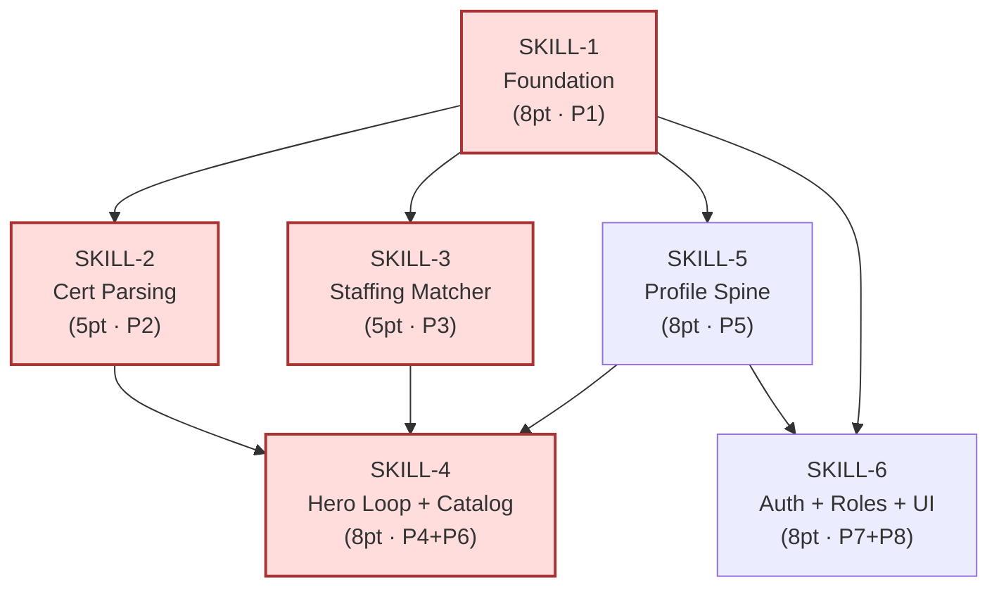

# Dependency Graph — SkillSync (Vertex Hackathon)

**Initiative:** `skillsync-vertex-hackathon` · **Stage:** 04-jira-creation · **Generated:** 2026-06-05

The blocks / blocked_by DAG across SKILL-1 … SKILL-6. Acyclic; the critical path is `SKILL-1 → SKILL-2 → SKILL-3 → SKILL-4`.

---

## DAG

> Red = critical path (hero loop). SKILL-5 also feeds SKILL-4 (the loop's recommendation acts on profile-spine baseline skills/gaps) and SKILL-6 (profile/plan state surfaced by the progress view + screens).

---

## Edge list (blocks / blocked_by)

| Story | blocks | blocked_by |
|---|---|---|
| SKILL-1 | SKILL-2, SKILL-3, SKILL-5, SKILL-6 | — (critical-path root) |
| SKILL-2 | SKILL-4 | SKILL-1 |
| SKILL-3 | SKILL-4 | SKILL-1 |
| SKILL-4 | — | SKILL-1, SKILL-2, SKILL-3 (+ consumes SKILL-5 catalog/profile context) |
| SKILL-5 | SKILL-4, SKILL-6 | SKILL-1 |
| SKILL-6 | — | SKILL-1, SKILL-5 |

> Note: SKILL-4's hard upstream blockers are SKILL-1/2/3 (the loop reuses the cert write + the matcher). It additionally *consumes* SKILL-5 (catalog recommendations act on profile-spine baseline skills) — modeled as a soft feed in the graph, a hard `blocks` from SKILL-5's side.

---

## Topological build order

1. **SKILL-1** (root — no blockers)
2. **SKILL-2**, **SKILL-3**, **SKILL-5** (parallelizable off SKILL-1; same repo → sequence to avoid merge conflicts)
3. **SKILL-4** (after SKILL-1/2/3; consumes SKILL-5 catalog/profile context)
4. **SKILL-6** (after SKILL-1 + SKILL-5; final delivery surface + freeze gate)

## Validation

- **No cycles:** the graph is acyclic (verified by the topological order above).
- **Single repo:** all 6 stories target `ai-nu-skillsync` → `parallelization_group = ai-nu-skillsync`; parallel branches risk merge conflicts, so execute in dependency order.
- **Critical path:** `SKILL-1 → SKILL-2 → SKILL-3 → SKILL-4` must not slip (the hero loop).
